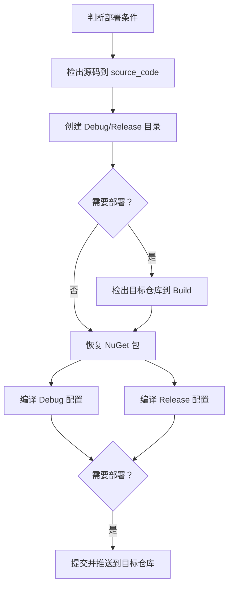

```markdown
# IFoxCAD 项目：构建与部署工作流程使用指南

## 1. 工作流程核心功能与触发
本指南介绍 `.github/workflows/build-and-deploy.yml` 的 GitHub Actions 工作流程，用于自动化项目的构建及产物部署。

### 主要功能
- **构建（Build）**：编译 IFoxCAD.AutoCad 项目的 Debug 和 Release 配置
- **部署（Deploy）**：根据条件将构建产物推送至 `FsDiG/Build` 仓库

### 触发条件
| 触发场景 | 效果 |
|----------|------|
| 推送到 main 分支 | 执行编译<br>提交信息含 `[deploy]` 时执行部署 |
| 向 main 分支发起 PR | 执行编译（PR 校验）<br>**不执行**部署 |
| 提交含 `[build]`/`[deploy]` 到任意分支<br>`git commit -m "feat [build]"` | 执行编译<br>`[deploy]` 存在时执行部署 |
| 手动触发 (workflow_dispatch) | 执行编译<br>`deploy` 参数为 true 时执行部署 |

## 2. 部署执行条件
仅当满足以下任一条件时执行部署：
```bash
# 条件1：提交信息包含 [deploy]
git commit -m "hotfix [deploy]"

# 条件2：手动触发时设置 deploy=true
```
> **部署示例**  
> `git commit -m "feat: new feature [build] [deploy]"`  
> `git commit -m "hotfix: critical update [deploy]"`

## 3. 标签说明
### `[build]` 标签
- 确保任意分支的 push 事件触发编译
- **示例**：`git commit -m "fix: resolve issue [build]"`

### `[deploy]` 标签
- 确保 push 事件触发编译
- 构建成功后执行部署
- **示例**：  
  `git commit -m "feat: release [deploy]"`  
  `git commit -m "feat: update [build] [deploy]"`

## 4. 工作流程执行顺序


## 5. 自托管执行器要求
执行器必须安装：
- MSBuild
- PowerShell
- Git
- 访问 `github.com` 的权限
- 相应执行权限

## 6. 关键配置说明
| 配置项 | 说明 |
|--------|------|
| `BUILD_REPO_TOKEN` | 存储于仓库 Secrets<br>需目标仓库写入权限 |
| 产物输出路径 | Debug → `Build/DiGLib/DiGArchBase/x64_2019_Debug`<br>Release → `Build/DiGLib/DiGArchBase/x64_2019_Release` |
| 状态查看 | GitHub Actions 标签页查看日志 |
| 构建特性 | **直接输出**到目标仓库目录<br>无需额外复制操作 |
```