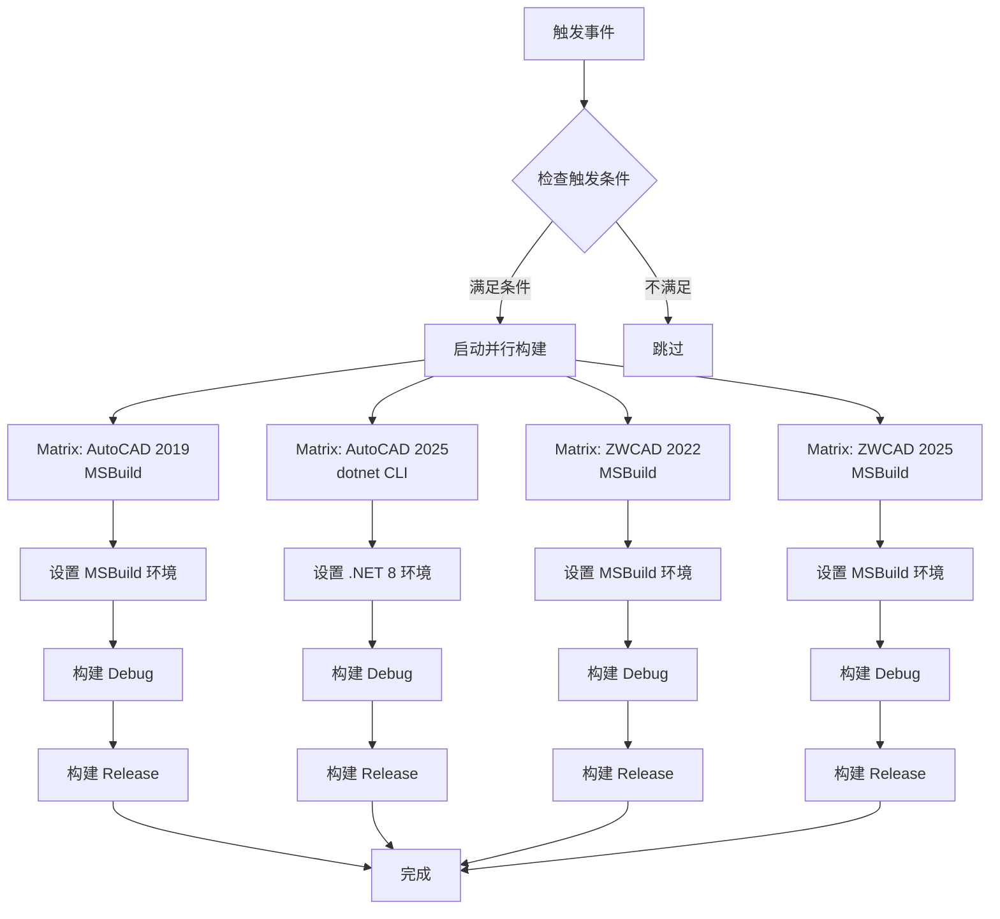

# IFoxCAD 项目：构建检查工作流程使用指南

## 1. 工作流程核心功能与触发

本指南介绍 `.github/workflows/build-and-deploy.yml` 的 GitHub Actions 工作流程，用于自动化项目的构建检查。

### 主要功能
- **并行构建**：使用 Matrix 策略并行编译 4 个平台版本的 Debug 和 Release 配置
- **多工具支持**：自动选择 MSBuild 或 dotnet CLI 进行构建
- **持续集成**：确保代码变更不会破坏构建

### 触发条件

| 触发场景 | 说明 | 示例 |
|----------|------|------|
| 推送到 main 分支 | 自动执行所有平台的构建检查 | `git push origin main` |
| 向 main 分支发起 PR | 执行构建检查（PR 校验） | 创建 Pull Request |
| 提交含 `[build]` 到任意分支 | 在任意分支触发构建检查 | `git commit -m "feat: new feature [build]"` |
| 提交含 `[deploy]` 到任意分支 | 触发构建检查（保留未来扩展） | `git commit -m "fix: bug fix [deploy]"` |
| 手动触发 (workflow_dispatch) | 通过 GitHub UI 手动触发构建 | Actions 页面点击 "Run workflow" |

## 2. Matrix 并行构建策略

本工作流使用 Matrix 策略并行构建 4 个平台版本，显著提升构建效率。

### 构建矩阵配置

| 项目 | 构建工具 | 框架版本 | 输出路径前缀 |
|------|---------|---------|-------------|
| AutoCAD 2019 And Test | MSBuild | .NET Framework 4.8 | `AC_2019` |
| AutoCAD 2025 And Test | dotnet CLI | .NET 8.0 | `AC_2025` |
| ZWCAD 2022 And Test | MSBuild | .NET Framework 4.8 | `ZW_2022` |
| ZWCAD 2025 And Test | MSBuild | .NET Framework 4.8 | `ZW_2025` |

### 构建配置

每个平台版本会构建两个配置：
- **Debug**：输出到 `Build\{prefix}_Debug\`
- **Release**：输出到 `Build\{prefix}_Release\`

例如 AutoCAD 2019 的输出路径：
- Debug: `Build\AC_2019_Debug\`
- Release: `Build\AC_2019_Release\`

## 3. 标签使用说明

### `[build]` 标签
- **用途**：在任意分支触发构建检查
- **示例**：
  ```bash
  git commit -m "fix: resolve issue [build]"
  git push origin feature-branch
  ```
- **场景**：在功能分支开发时，需要验证构建是否成功

### `[deploy]` 标签
- **用途**：触发构建检查（保留用于未来扩展部署功能）
- **示例**：
  ```bash
  git commit -m "feat: new feature [deploy]"
  git push origin main
  ```
- **说明**：当前版本仅触发构建，未实现实际部署

### 不使用标签
- main 分支的所有推送自动触发构建
- PR 到 main 分支自动触发构建检查

## 4. 工作流程执行流程



## 5. 构建工具说明

### MSBuild 构建（.NET Framework 项目）
适用于：AutoCAD 2019、ZWCAD 2022、ZWCAD 2025

构建命令：
```powershell
msbuild {项目路径} '/t:Restore;Build' `
  /p:OutputPath="..\..\Build\{prefix}_{config}\" `
  /p:Configuration={config} /p:Platform="Any CPU" /verbosity:minimal
```

### dotnet CLI 构建（.NET 8 项目）
适用于：AutoCAD 2025

构建命令：
```powershell
dotnet build {项目路径} --configuration {config}
```

## 6. 自托管执行器要求

执行器必须安装以下环境：

| 组件 | 版本要求 | 用途 |
|------|---------|------|
| MSBuild | Visual Studio 2019+ | 构建 .NET Framework 项目 |
| .NET SDK | 8.0.x | 构建 .NET 8 项目 |
| PowerShell | 5.1+ | 执行构建脚本 |
| Git | 最新版 | 代码检出 |

### 验证环境配置

```powershell
# 检查 MSBuild
msbuild -version

# 检查 .NET SDK
dotnet --version

# 检查 PowerShell
$PSVersionTable.PSVersion

# 检查 Git
git --version
```

## 7. 输出路径结构

构建产物输出到项目根目录下的 `Build` 文件夹：

```
Build/
├── AC_2019_Debug/    # AutoCAD 2019 Debug 构建
├── AC_2019_Release/        # AutoCAD 2019 Release 构建
├── AC_2025_Debug/          # AutoCAD 2025 Debug 构建
├── AC_2025_Release/    # AutoCAD 2025 Release 构建
├── ZW_2022_Debug/          # ZWCAD 2022 Debug 构建
├── ZW_2022_Release/        # ZWCAD 2022 Release 构建
├── ZW_2025_Debug/      # ZWCAD 2025 Debug 构建
└── ZW_2025_Release/        # ZWCAD 2025 Release 构建
```

## 8. 并行构建优势

1. **速度提升**：4 个平台同时构建，大幅缩短总构建时间
2. **独立性**：某个平台构建失败不影响其他平台
3. **资源利用**：充分利用 Runner 的多核 CPU
4. **易于调试**：每个平台的构建日志独立，便于问题定位

## 9. 故障排查

### 查看构建日志

1. 进入 GitHub Actions 页面
2. 选择对应的工作流运行记录
3. 查看具体 Matrix 任务的日志（如 "Build AutoCAD 2025 And Test"）

### 常见问题

#### 1. MSBuild 构建失败
**症状**：`.NET Framework` 项目构建失败

**排查**：
- 检查 Runner 是否安装 MSBuild
- 验证 .NET Framework 4.8 SDK 是否安装
- 查看具体错误信息

#### 2. dotnet CLI 构建失败
**症状**：AutoCAD 2025 项目构建失败

**排查**：
- 检查 Runner 是否安装 .NET 8 SDK
- 运行 `dotnet --list-sdks` 确认版本
- 检查项目文件是否正确配置

#### 3. 某个 Matrix 任务失败
**症状**：部分平台构建成功，部分失败

**操作**：
- 查看失败任务的详细日志
- 确认该平台特定的依赖是否满足
- 单独排查该平台的构建问题

#### 4. 工作流未触发
**症状**：推送代码后工作流没有运行

**排查**：
- 检查是否满足触发条件
- 确认 `.github/workflows/build-and-deploy.yml` 文件存在
- 查看 Actions 页面是否有错误提示

## 10. 最佳实践

### 开发工作流建议

1. **功能分支开发**
   ```bash
   git checkout -b feature/new-feature
   # 开发完成后
git commit -m "feat: implement feature [build]"
   git push origin feature/new-feature
   ```
   使用 `[build]` 标签验证构建是否成功

2. **合并到 main 分支前**
   - 创建 PR，自动触发构建检查
   - 等待所有 Matrix 任务通过
   - 确认构建成功后再合并

3. **紧急修复**
   ```bash
   git checkout -b hotfix/critical-bug
   git commit -m "fix: critical bug [build]"
   git push origin hotfix/critical-bug
   ```
   快速验证修复不会破坏构建

### 监控构建状态

- 在 GitHub 仓库页面查看 Actions 徽章
- 订阅工作流失败通知
- 定期检查构建日志

## 11. 与 Release 工作流的关系

| 工作流 | 用途 | 触发方式 | 输出 |
|--------|------|---------|------|
| **build-and-deploy.yml** | 日常开发构建检查 | 推送代码、PR、标签 | 本地 `Build` 目录 |
| **release.yml** | 正式版本发布 | 推送版本标签 (v*) | NuGet.org + GitHub Release |

**开发流程建议**：
1. 日常开发：使用 `build-and-deploy.yml` 进行持续集成验证
2. 版本发布：使用 `release.yml` 发布到 NuGet

两个工作流互不干扰，可以同时使用。

## 12. 手动触发说明

### 通过 GitHub UI 手动触发

1. 进入仓库的 Actions 页面
2. 选择 "构建检查" 工作流
3. 点击 "Run workflow" 按钮
4. 选择要构建的分支
5. （可选）勾选 deploy 选项（当前版本仅触发构建）
6. 点击 "Run workflow" 确认

### 手动触发的用途

- 重新运行构建以验证环境
- 在不推送代码的情况下测试构建
- 调试工作流配置

## 13. 扩展配置

### 添加新的平台版本

如需添加新的 CAD 平台版本，在 `matrix.include` 中添加配置：

```yaml
- project: 新平台名称
  path: tests/TestNewPlatform/TestNewPlatform.csproj
  build-tool: msbuild  # 或 dotnet
  output-prefix: NEW_2026
```

### 修改输出路径

修改 `output-prefix` 可以更改输出目录名称。

### 调整构建详细程度

MSBuild 项目可以修改 `/verbosity` 参数：
- `quiet`：仅显示错误
- `minimal`：最小输出（默认）
- `normal`：正常输出
- `detailed`：详细输出
- `diagnostic`：诊断级别

## 14. 相关资源

- [GitHub Actions 文档](https://docs.github.com/en/actions)
- [GitHub Actions Matrix 策略](https://docs.github.com/en/actions/using-jobs/using-a-matrix-for-your-jobs)
- [MSBuild 命令行参考](https://docs.microsoft.com/en-us/visualstudio/msbuild/msbuild-command-line-reference)
- [dotnet CLI 文档](https://docs.microsoft.com/en-us/dotnet/core/tools/)