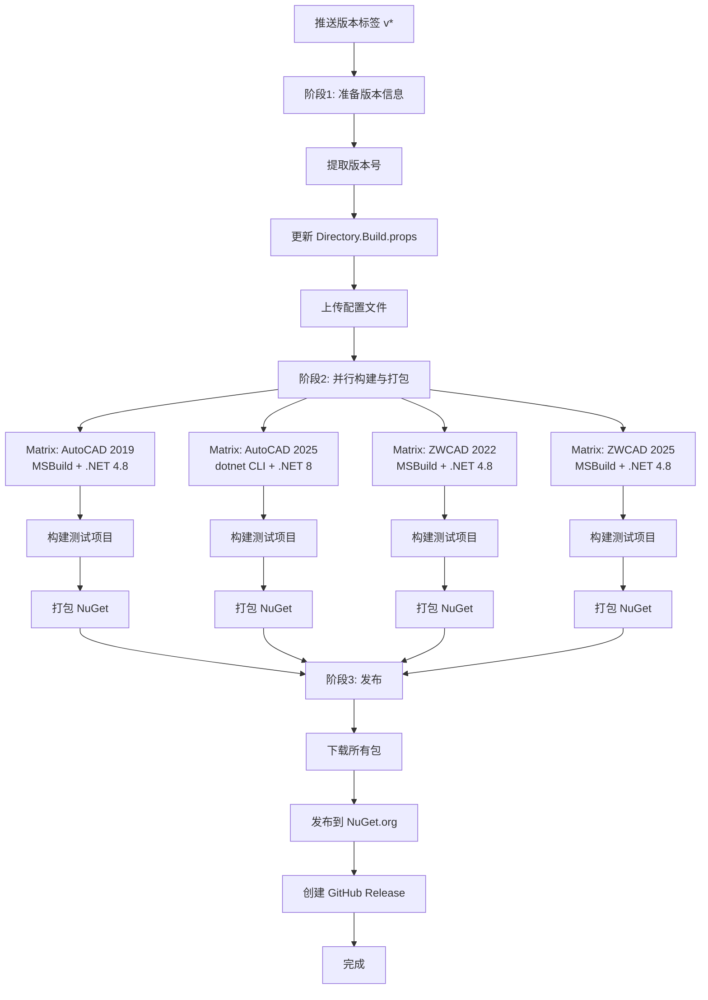

# IFoxCAD 项目：NuGet 发布工作流程使用指南

## 1. 工作流程核心功能

本指南介绍 `.github/workflows/release.yml` 的 GitHub Actions 工作流程，用于自动化项目的构建和 NuGet 包发布。

### 主要功能
- **自动化构建**：并行编译所有 CAD 平台版本的项目（AutoCAD 2019/2025，ZWCAD 2022/2025）
- **版本管理**：从 Git 标签自动提取版本号并更新项目文件
- **并行打包**：使用 Matrix 策略并行构建和打包多个平台版本
- **NuGet 发布**：将编译后的包发布到 NuGet.org
- **GitHub Release**：创建 GitHub Release 并附带 NuGet 包

### 触发条件
| 触发场景 | 命令示例 | 效果 |
|----------|---------|------|
| 推送版本标签 | `git tag v1.0.0 && git push origin v1.0.0` | 自动构建并发布到 NuGet |

## 2. 工作流程架构

本工作流采用**三阶段流水线**设计，提高构建效率：

### 阶段 1：准备 (Prepare)
- 从 Git 标签提取版本号（去掉 'v' 前缀）
- 更新 `src/Directory.Build.props` 中的版本号
- 上传更新后的配置文件供后续作业使用

### 阶段 2：并行构建与打包 (Build-and-Pack)
使用 Matrix 策略并行处理 4 个平台版本：

| CAD 平台 | 版本 | 构建工具 | .NET 框架 | 输出路径 |
|---------|------|---------|----------|---------|
| AutoCAD | 2019 | MSBuild | .NET Framework 4.8 | `Build\AC_2019_Release` |
| AutoCAD | 2025 | dotnet CLI | .NET 8.0 | `Build\AC_2025_Release` |
| ZWCAD | 2022 | MSBuild | .NET Framework 4.8 | `Build\ZW_2022_Release` |
| ZWCAD | 2025 | MSBuild | .NET Framework 4.8 | `Build\ZW_2025_Release` |

每个 Matrix 任务执行：
1. 下载更新后的版本配置文件
2. 设置对应的构建环境（.NET 8 或 MSBuild）
3. 构建测试项目
4. 打包 NuGet 包
5. 上传打包结果为 Artifact

### 阶段 3：发布 (Publish)
- 下载所有并行构建生成的 NuGet 包
- 批量发布到 NuGet.org
- 创建 GitHub Release 并附带所有包文件

## 3. 发布新版本的步骤

### 步骤 1：更新代码并提交
```bash
# 确保所有代码改动已提交
git add .
git commit -m "feat: 新功能描述"
git push origin main
```

### 步骤 2：创建版本标签
```bash
# 创建版本标签（例如 v1.0.0）
git tag v1.0.0

# 推送标签到远程仓库（这将触发发布工作流）
git push origin v1.0.0
```

### 步骤 3：工作流自动执行
标签推送后，GitHub Actions 将自动：

**准备阶段：**
1. 检出代码
2. 从标签提取版本号（去掉 'v' 前缀）
3. 更新 `src/Directory.Build.props` 中的版本号
4. 上传更新后的配置文件

**并行构建阶段（4 个任务同时执行）：**
1. 下载更新后的版本配置
2. 设置对应的构建环境（.NET 8 / MSBuild）
3. 恢复 NuGet 包依赖
4. 构建测试项目验证功能
5. 打包对应平台的 NuGet 包
6. 上传打包结果

**发布阶段：**
1. 下载所有打包好的 NuGet 包
2. 批量发布到 NuGet.org（跳过重复版本）
3. 创建 GitHub Release
4. 上传所有包文件到 Release

## 4. 配置要求

### 必需的 GitHub Secrets
在仓库设置中添加以下 Secrets：

| Secret 名称 | 说明 | 获取方式 |
|------------|------|---------|
| `NUGET_API_KEY` | NuGet.org API 密钥 | 访问 https://www.nuget.org/account/apikeys 创建 |
| `BUILD_REPO_TOKEN` | GitHub Personal Access Token | 用于创建 Release，需要 `contents: write` 权限 |

### 详细配置步骤

快速步骤：
1. 进入 GitHub 仓库页面
2. 点击 `Settings` → `Secrets and variables` → `Actions`
3. 点击 `New repository secret`
4. 添加所需的 Secrets：
   - `NUGET_API_KEY`：从 NuGet.org 获取
   - `BUILD_REPO_TOKEN`：从 GitHub Settings → Developer settings → Personal access tokens 创建
5. 点击 `Add secret`

### 自托管执行器要求
执行器必须安装：
- **.NET 8 SDK**（用于 AutoCAD 2025）
- **MSBuild**（用于其他 .NET Framework 4.8 项目）
- **PowerShell**
- **Git**
- 访问 `github.com` 和 `nuget.org` 的网络权限

## 5. 项目包说明

本工作流会生成以下 NuGet 包：

| 包名称 | 目标平台 | .NET 框架 | 构建工具 | 说明 |
|--------|---------|----------|---------|------|
| `IFox.CAD.ACAD2019` | AutoCAD 2019 | .NET Framework 4.8 | MSBuild | AutoCAD 2019 支持 |
| `IFox.CAD.ACAD2025` | AutoCAD 2025 | .NET 8.0 | dotnet CLI | AutoCAD 2025 支持 |
| `IFox.CAD.ZCAD2022` | ZWCAD 2022 | .NET Framework 4.8 | MSBuild | 中望CAD 2022 支持 |
| `IFox.CAD.ZCAD2025` | ZWCAD 2025 | .NET Framework 4.8 | MSBuild | 中望CAD 2025 支持 |

## 6. 版本号规范

推荐使用语义化版本 (Semantic Versioning)：

- **主版本号 (Major)**：不兼容的 API 修改
- **次版本号 (Minor)**：向下兼容的功能新增
- **修订号 (Patch)**：向下兼容的问题修正

示例：
- `v1.0.0` - 第一个稳定版本
- `v1.1.0` - 新增功能
- `v1.1.1` - 修复 bug
- `v2.0.0` - 重大更新，可能不兼容

预发布版本：
- `v1.0.0-alpha` - Alpha 版本
- `v1.0.0-beta` - Beta 版本
- `v1.0.0-rc1` - Release Candidate 1

## 7. 工作流程图



## 8. 并行构建优势

相比串行构建，Matrix 并行策略具有以下优势：

1. **构建速度提升**：4 个平台版本同时构建，理论上可节省 75% 的构建时间
2. **独立性强**：每个平台的构建失败不影响其他平台
3. **易于扩展**：添加新平台版本只需在 Matrix 中增加配置
4. **日志清晰**：每个平台的构建日志独立，便于排查问题

### Matrix 配置说明

每个 Matrix 项包含以下配置：
- `cad`：CAD 平台名称（AutoCAD / ZWCAD）
- `version`：版本号（2019 / 2022 / 2025）
- `test-project`：测试项目路径
- `pack-project`：打包项目路径
- `build-tool`：构建工具（msbuild / dotnet）
- `output-path`：输出路径
- `framework`：目标框架

## 9. 故障排查

### 工作流失败时的检查项

1. **检查 Secrets 配置**
   - 确认 `NUGET_API_KEY` 已添加且名称正确
   - 确认 `BUILD_REPO_TOKEN` 已添加且有 `contents: write` 权限
   - 确认 API Key 有发布权限且未过期

2. **检查版本号格式**
   - 标签必须以 'v' 开头（如 v1.0.0）
   - 版本号符合语义化版本规范

3. **检查构建错误**
   - 查看对应 Matrix 任务的日志
   - 确认所有依赖包可以正常下载
   - MSBuild 项目检查 .NET Framework 4.8 是否安装
   - dotnet CLI 项目检查 .NET 8 SDK 是否安装

4. **检查包冲突**
   - 如果版本已存在于 NuGet.org，发布会被自动跳过（`--skip-duplicate`）
   - 使用新的版本号重新发布

5. **检查 Artifacts**
   - 在工作流运行页面查看是否所有 Artifacts 都已上传
   - 包名格式：`package-{CAD}-{Version}`（如 `package-AutoCAD-2025`）

## 10. 与现有构建流程的关系

- **build-and-deploy.yml**：用于日常开发构建，输出到 Build 仓库（自托管 runner）
- **release.yml**：用于正式版本发布，输出到 NuGet.org（自托管 runner，并行构建）

两个工作流相互独立，可以同时存在：
- 开发过程使用 `build-and-deploy.yml` 进行持续集成
- 发布版本时使用 `release.yml` 发布到 NuGet

## 11. 最佳实践

1. **发布前测试**
   - 在推送标签前，确保主分支的代码已经过充分测试
   - 可以先在分支上进行 `[build]` 测试

2. **版本号递增**
   - 每次发布使用新的版本号
   - 不要重复使用已发布的版本号

3. **发布说明**
   - GitHub Release 会自动生成，包含版本信息和包列表
   - 可以在 Release 页面手动补充详细说明和更新日志

4. **回滚策略**
   - 如果发布的包有问题，不要删除包（NuGet 不允许）
   - 发布新版本修复问题，并标记旧版本为已弃用

5. **监控构建状态**
   - 关注 Matrix 任务的并行执行情况
   - 如果某个平台构建失败，可以单独排查

## 12. 构建产物路径

各平台的构建产物输出路径：

| 平台 | 输出路径 |
|------|---------|
| AutoCAD 2019 | `Build\AC_2019_Release` |
| AutoCAD 2025 | `Build\AC_2025_Release` |
| ZWCAD 2022 | `Build\ZW_2022_Release` |
| ZWCAD 2025 | `Build\ZW_2025_Release` |

所有 NuGet 包统一输出到：`artifacts/*.nupkg`

## 13. 相关链接

- [NuGet 包管理](https://www.nuget.org/)
- [语义化版本规范](https://semver.org/lang/zh-CN/)
- [GitHub Actions 文档](https://docs.github.com/en/actions)
- [GitHub Actions Matrix 策略](https://docs.github.com/en/actions/using-jobs/using-a-matrix-for-your-jobs)
