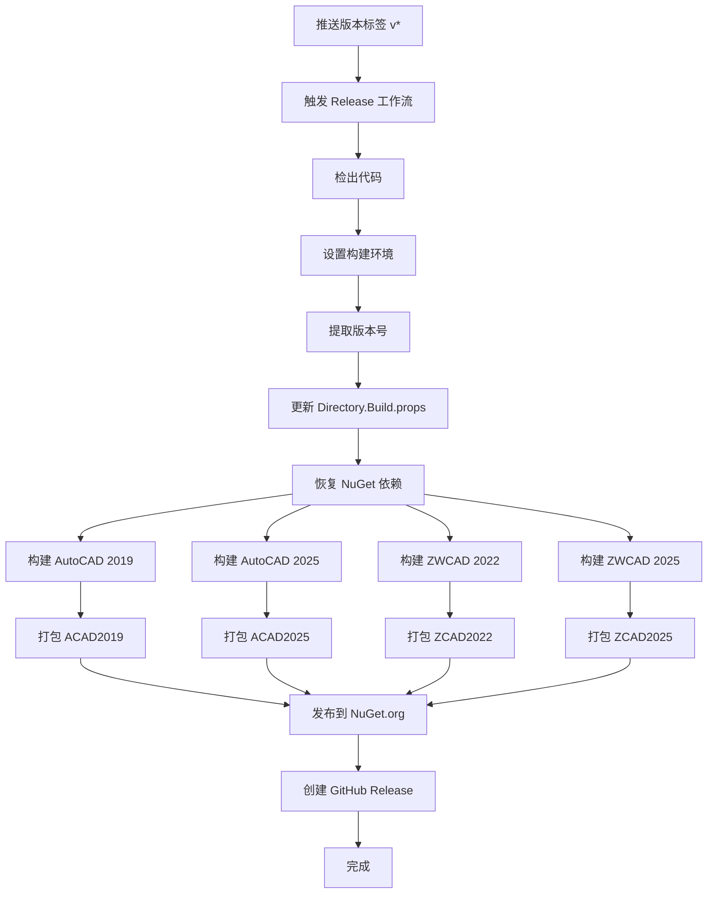

# IFoxCAD 项目：NuGet 发布工作流程使用指南

## 1. 工作流程核心功能

本指南介绍 `.github/workflows/release.yml` 的 GitHub Actions 工作流程，用于自动化项目的构建和 NuGet 包发布。

### 主要功能
- **自动化构建**：编译所有 CAD 平台版本的项目（AutoCAD 2019/2025，ZWCAD 2022/2025）
- **版本管理**：从 Git 标签自动提取版本号并更新项目文件
- **NuGet 发布**：将编译后的包发布到 NuGet.org
- **GitHub Release**：创建 GitHub Release 并附带 NuGet 包

### 触发条件
| 触发场景 | 命令示例 | 效果 |
|----------|---------|------|
| 推送版本标签 | `git tag v1.0.0 && git push origin v1.0.0` | 自动构建并发布到 NuGet |

## 2. 发布新版本的步骤

### 步骤 1：更新代码并提交
```bash
# 确保所有代码改动已提交
git add .
git commit -m "feat: 新功能描述"
git push origin main
```

### 步骤 2：创建版本标签
```bash
# 创建版本标签（例如 v1.0.0）
git tag v1.0.0

# 推送标签到远程仓库（这将触发发布工作流）
git push origin v1.0.0
```

### 步骤 3：工作流自动执行
标签推送后，GitHub Actions 将自动：
1. 检出代码
2. 设置 .NET 8 和 MSBuild 环境
3. 从标签提取版本号（去掉 'v' 前缀）
4. 更新 `src/Directory.Build.props` 中的版本号
5. 恢复 NuGet 包依赖
6. 构建所有项目：
   - AutoCAD 2019 (使用 MSBuild，.NET Framework 4.8)
   - AutoCAD 2025 (使用 dotnet CLI，.NET 8.0)
   - ZWCAD 2022 (使用 MSBuild，.NET Framework 4.8)
   - ZWCAD 2025 (使用 MSBuild，.NET Framework 4.8)
7. 打包所有项目为 NuGet 包
8. 发布包到 NuGet.org（需要配置 NUGET_API_KEY）
9. 创建 GitHub Release 并上传包文件

## 3. 配置要求

### 必需的 GitHub Secrets
在仓库设置中添加以下 Secret：

| Secret 名称 | 说明 | 获取方式 |
|------------|------|---------|
| `NUGET_API_KEY` | NuGet.org API 密钥 | 访问 https://www.nuget.org/account/apikeys 创建 |

### 详细配置步骤

请参考：[NuGet API Key 配置指南](../../docs/NuGet_API_Key_Setup.md)

快速步骤：
1. 进入 GitHub 仓库页面
2. 点击 `Settings` → `Secrets and variables` → `Actions`
3. 点击 `New repository secret`
4. 名称填写 `NUGET_API_KEY`
5. 值填写从 NuGet.org 获取的 API Key
6. 点击 `Add secret`

## 4. 项目包说明

本工作流会生成以下 NuGet 包：

| 包名称 | 目标平台 | .NET 框架 | 说明 |
|--------|---------|----------|------|
| `IFox.CAD.ACAD2019` | AutoCAD 2019 | .NET Framework 4.8 | AutoCAD 2019 支持 |
| `IFox.CAD.ACAD2025` | AutoCAD 2025 | .NET 8.0 | AutoCAD 2025 支持 |
| `IFox.CAD.ZCAD2022` | ZWCAD 2022 | .NET Framework 4.8 | 中望CAD 2022 支持 |
| `IFox.CAD.ZCAD2025` | ZWCAD 2025 | .NET Framework 4.8 | 中望CAD 2025 支持 |

## 5. 版本号规范

推荐使用语义化版本 (Semantic Versioning)：

- **主版本号 (Major)**：不兼容的 API 修改
- **次版本号 (Minor)**：向下兼容的功能新增
- **修订号 (Patch)**：向下兼容的问题修正

示例：
- `v1.0.0` - 第一个稳定版本
- `v1.1.0` - 新增功能
- `v1.1.1` - 修复 bug
- `v2.0.0` - 重大更新，可能不兼容

预发布版本：
- `v1.0.0-alpha` - Alpha 版本
- `v1.0.0-beta` - Beta 版本
- `v1.0.0-rc1` - Release Candidate 1

## 6. 工作流程图



## 7. 故障排查

### 工作流失败时的检查项

1. **检查 NUGET_API_KEY 是否配置正确**
   - 确认 Secret 已添加且名称正确
   - 确认 API Key 有发布权限且未过期

2. **检查版本号格式**
   - 标签必须以 'v' 开头（如 v1.0.0）
   - 版本号符合语义化版本规范

3. **检查构建错误**
   - 查看工作流日志中的具体错误信息
   - 确认所有依赖包可以正常下载

4. **检查包冲突**
   - 如果版本已存在于 NuGet.org，发布会被跳过
   - 使用新的版本号重新发布

## 8. 与现有构建流程的关系

- **build-and-deploy.yml**：用于日常开发构建，输出到 Build 仓库（自托管 runner）
- **release.yml**：用于正式版本发布，输出到 NuGet.org（GitHub-hosted runner）

两个工作流相互独立，可以同时存在：
- 开发过程使用 `build-and-deploy.yml` 进行持续集成
- 发布版本时使用 `release.yml` 发布到 NuGet

## 9. 最佳实践

1. **发布前测试**
   - 在推送标签前，确保主分支的代码已经过充分测试
   - 可以先在分支上进行 `[build]` 测试

2. **版本号递增**
   - 每次发布使用新的版本号
   - 不要重复使用已发布的版本号

3. **发布说明**
   - 在推送标签前，准备好 Release Notes
   - 可以在 GitHub Release 页面手动补充详细说明

4. **回滚策略**
   - 如果发布的包有问题，不要删除包（NuGet 不允许）
   - 发布新版本修复问题，并标记旧版本为已弃用

## 10. 相关链接

- [NuGet 包管理](https://www.nuget.org/)
- [语义化版本规范](https://semver.org/lang/zh-CN/)
- [GitHub Actions 文档](https://docs.github.com/en/actions)
