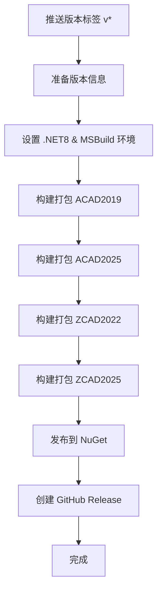

# IFoxCAD 项目：NuGet 发布工作流程使用指南

## 1. 工作流程核心功能

本指南介绍 `.github/workflows/release.yml` 的 GitHub Actions 工作流程，用于自动化项目的构建和 NuGet 包发布。

### 主要功能
- 单一作业（release）：顺序执行准备版本、构建打包四个目标、发布到 NuGet、创建 GitHub Release
- 版本管理：从 Git 标签自动提取版本号并更新 `src/Directory.Build.props`
- 多工具支持：同时支持 MSBuild（.NET Framework4.8）与 dotnet CLI（.NET8）
- NuGet 发布：将打包产物发布到 NuGet.org（跳过重复版本）
- GitHub Release：创建 Release 并附带生成的 `.nupkg`

### 触发条件
| 触发场景 | 命令示例 | 效果 |
|----------|---------|------|
| 推送版本标签 | `git tag v1.0.0 && git push origin v1.0.0` | 自动构建并发布到 NuGet |

## 2. 工作流程架构（单作业顺序）

 release 作业包含以下阶段，按顺序执行：

1) 准备版本
- 从 Git 标签读取版本（去掉前缀 v）
- 更新 `src/Directory.Build.props` 的 `<Version>`

2) 环境设置
- 安装 .NET8 SDK（用于 .NET8 项目）
- 安装 MSBuild（用于 .NET Framework4.8 项目）

3) 构建与打包
- AutoCAD2019（MSBuild）
- AutoCAD2025（dotnet CLI）
- ZWCAD2022（MSBuild）
- ZWCAD2025（MSBuild）

4) 发布与发布说明
- 将 `artifacts/*.nupkg` 发布到 NuGet.org（`--skip-duplicate`）
- 创建 GitHub Release，附带所有包文件

## 3. 发布新版本步骤

```bash
# 提交代码
git add .
git commit -m "feat: 新功能描述"
git push origin main

# 创建并推送标签
git tag v1.0.0
 git push origin v1.0.0
```

推送标签后，GitHub Actions 将自动执行上述 4 个阶段。

## 4. 配置要求

### 必需的 GitHub Secrets

| Secret 名称 | 说明 |
|------------|------|
| `NUGET_API_KEY` | NuGet.org API 密钥（用于 `dotnet nuget push`） |
| `BUILD_REPO_TOKEN` | GitHub Token（用于创建 Release，需 `contents: write`） |

仓库设置路径：Settings → Secrets and variables → Actions。

### 自托管执行器要求
- .NET8 SDK
- MSBuild（Visual Studio2019+）
- PowerShell、Git
- 能访问 `github.com` 与 `nuget.org`

## 5. 版本号规范

遵循语义化版本（SemVer）：
- 主版本（Major）：不兼容变更
- 次版本（Minor）：兼容新增
- 修订（Patch）：兼容修复

示例：`v1.0.0`、`v1.1.0`、`v1.1.1`、`v2.0.0`。

支持预发布标签：`v1.0.0-alpha`、`v1.0.0-beta`、`v1.0.0-rc.1`。

## 6. 工作流程图



## 7. 生成的包

| 包名称 | 目标平台 | .NET 框架 | 构建工具 |
|--------|---------|----------|---------|
| `IFox.CAD.ACAD2019` | AutoCAD2019 | .NET Framework4.8 | MSBuild |
| `IFox.CAD.ACAD2025` | AutoCAD2025 | .NET8.0 | dotnet CLI |
| `IFox.CAD.ZCAD2022` | ZWCAD2022 | .NET Framework4.8 | MSBuild |
| `IFox.CAD.ZCAD2025` | ZWCAD2025 | .NET Framework4.8 | MSBuild |

产物位置：`artifacts/*.nupkg`。

## 8. 故障排查

- Secrets 未配置或权限不足 → 设置 `NUGET_API_KEY`、`BUILD_REPO_TOKEN` 并确认权限
- 某目标构建失败 → 查看该阶段日志并确认对应 SDK/MSBuild 安装
- 标签格式不正确 → 必须以 `v` 开头，如 `v1.2.3`
- 包已存在 →由 `--skip-duplicate` 自动跳过，使用新版本号重新发布

## 9. 与构建检查工作流关系

| 工作流 | 用途 |触发方式 |
|--------|------|---------|
| `build-and-deploy.yml` | 日常构建检查（单作业顺序构建） | 推送代码、PR、标签、手动 |
| `release.yml` | 正式版本发布（单作业顺序构建与发布） | 推送版本标签 `v*` |

推荐流程：平时用构建检查工作流验证，发布时推送标签触发发布工作流。
