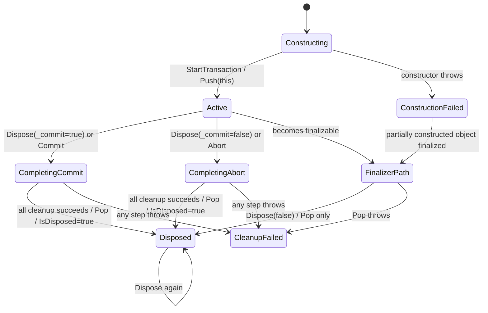

# DBTrans 生命周期与释放契约

> 状态：设计提案（Design Proposal）
>
> 基线：`main` @ `4d1bb7237ac020b16bf5d198c952b9a55cc3a1de`
>
> 跟踪：[Issue #46](https://github.com/FsDiG/Fs.Fox.CAD/issues/46)
>
> 上级任务：[Issue #43](https://github.com/FsDiG/Fs.Fox.CAD/issues/43)、[Issue #25](https://github.com/FsDiG/Fs.Fox.CAD/issues/25)
>
> 宿主验收能力：[Issue #40](https://github.com/FsDiG/Fs.Fox.CAD/issues/40)

## 1. 结论

`DBTrans` 当前同时承担 CAD `Transaction` 包装、文档锁和后台数据库所有权、默认提交策略，以及进程级“当前事务”栈四项职责。这些职责共享同一条释放路径，但当前只有 `IsDisposed` 一个二值状态，无法表达“清理到一半后失败”或“实例不是栈顶”等状态。

后续代码修改应按以下顺序拆分，不在一个 PR 中同时处理：

1. 在任何 `_commit` 修改或 CAD 资源操作之前，增加显式 LIFO 校验；非栈顶实例完成时 fail-fast。
2. 移除不能处理普通泄漏、且可能从终结器线程修改全局栈的终结器；继续要求调用方显式 `Dispose`。
3. 单独设计 Commit/Abort、`Transaction.Dispose`、`DocumentLock.Dispose` 和后台 `Database.Dispose` 的异常优先级与继续清理规则。
4. 只有发现真实的并发或跨上下文消费者后，才评估按 Document/Database 隔离事务上下文；本轮不引入 `ThreadLocal`、`AsyncLocal` 或全局锁。

以上均不得改变 `commit: true` 的默认行为、公共命名空间、程序集或 NuGet 包布局。

## 2. 证据标签

本文使用以下标签，避免把静态分析外推为 CAD 宿主结论：

| 标签 | 含义 |
| --- | --- |
| `Confirmed` | 可由基线源码、CLR 对象可达性或标准控制流直接确认；不代表 CAD 宿主场景已通过。 |
| `Needs host validation` | 需要在明确版本的 AutoCAD/ZWCAD 进程中执行后才能确认。 |
| `Decision` | 本文建议评审后固定的后续实现契约；当前生产代码尚未实现。 |
| `Not run` | 本轮没有执行对应 CAD 宿主验证。 |

本 PR 只增加设计文档，不修改生产代码，也不宣称任何宿主生命周期场景已通过。

## 3. 当前成员与所有权

| 成员 | 当前来源与用途 | 当前所有权/释放行为 | 证据 |
| --- | --- | --- | --- |
| `_dBTrans` | 进程级静态 `Stack<DBTrans>`；构造完成后压入，`Top`、`GetTop` 和部分扩展方法读取它。 | 栈对每个元素持有强引用；`Dispose(bool)` 最后无条件弹出一个元素。 | [S1] [S2] [S8] [S9] |
| `Transaction` | 三类构造函数都通过目标 `Database.TransactionManager.StartTransaction()` 创建。 | 由 `DBTrans` 创建；仅 `Dispose(true)` 尝试 Commit/Abort 后 Dispose。 | [S3] [S4] [S8] |
| `_documentLock` | 当前文档构造函数可按 `docLock` 获取；文件构造函数前台开图时获取。 | 非空时由 `DBTrans` 获取并在 `Dispose(true)` 中释放。 | [S3] [S4] [S8] |
| `Database` | 可能来自现有 Document、调用方参数、已打开文件对应的 Document，也可能由文件构造函数创建。 | 当前没有独立所有权字段；只要 `_fileName` 非空，`Dispose(true)` 就调用 `Database.Dispose()`。 | [S3] [S4] [S8] |
| `Document` / `Editor` | 从当前/指定 Document 或给定 Database 映射得到。 | 借用引用；`DBTrans` 不直接 Dispose。 | [S3] [S4] |
| `_fileName` | 仅文件构造函数设置，用于开图路径和判断是否 Dispose `Database`。 | 它能表示“由文件构造函数进入”，但不能表示 `Database` 是否确由本实例创建。 | [S4] [S8] |
| `_commit` | 构造参数初始化；`Commit()` / `Abort()` 在调用 `Dispose()` 前覆盖。 | 控制释放时调用 CAD Commit 还是 Abort；默认值为 `true`。 | [S3] [S4] [S6] |
| `IsDisposed` | 公开只读状态。 | 仅全部清理、Pop 成功后设为 `true`；异常中断时仍为 `false`。 | [S7] [S8] |

### 3.1 Database 所有权缺口

`Confirmed`：文件名构造函数并不总是创建后台 `Database`。当目标文件已在文档管理器中打开，或 `activeOpen: true` 时，它会借用对应 Document 的 `Database`；但当前释放条件只是 `_fileName` 非空，因此这些路径也会执行 `Database.Dispose()`。[S4] [S8]

`Needs host validation`：在四个正式宿主中 Dispose 借用的 Document Database 会造成何种异常、文档状态或后续命令影响，本轮未运行。

`Decision`：清理异常设计阶段应引入明确的内部所有权状态，例如“本实例创建的后台 Database”，不能继续用 `_fileName` 代理所有权。该修改不得改变调用方传入 `Database` 或前台 Document 的所有权。

## 4. 当前状态模型

源码没有显式状态枚举。以下状态是从字段和控制流推导出的分析模型：

| 状态 | 可观察条件 | 当前允许的操作 |
| --- | --- | --- |
| `Constructing` | CAD 资源可能已部分取得，但尚未执行 `_dBTrans.Push(this)`。 | 仅构造函数内部继续执行；异常时没有统一回收路径。 |
| `ConstructionFailed` | 构造函数抛异常，调用方未取得实例。 | 部分构造对象之后仍可能进入终结器路径；当前没有“是否已入栈”标记。 |
| `Active` | 构造成功、已入栈、`IsDisposed == false`。 | 读写对象、`Commit()`、`Abort()` 或 `Dispose()`。 |
| `Completing` | 已进入 `Dispose(true)`，但 `IsDisposed` 尚未设为 `true`。 | 当前没有独立标记；重入与部分失败无法仅凭字段区分。 |
| `CleanupFailed` | Commit/Abort 或任一后续清理步骤抛异常。 | `IsDisposed` 仍为 `false`；资源和栈可能处于部分完成状态。 |
| `Disposed` | 清理路径到达结尾，已执行一次 `Pop()` 且 `IsDisposed == true`。 | 再次 `Dispose()` 为 no-op；当前 `Commit()` / `Abort()` 仍会先改 `_commit`，再由 `Dispose()` 返回。 |
| `FinalizerPath` | 实例不再被任何强引用持有，终结器调用 `Dispose(false)`。 | 跳过全部 CAD 资源清理，但仍执行 `Pop()` 并设置 `IsDisposed`。 |



`Confirmed`：普通的“忘记 Dispose”实例仍被静态 `_dBTrans` 强引用，因此不会变成不可达对象；终结器不能作为这类泄漏的可靠安全网。`FinalizerPath` 只可能在实例从未入栈、已因其他路径离开栈或栈被错误弹出等情况下发生。[S1] [S7]

## 5. 当前操作序列

### 5.1 构造成功

1. 解析或创建 `Document`、`Editor`、`Database`。
2. 按路径可选获取 `DocumentLock`。
3. 创建 CAD `Transaction`。
4. 设置 `_commit`。
5. `_dBTrans.Push(this)`，进入 `Active`。

三类构造函数都在创建 Transaction 后入栈，但在入栈前取得的 DocumentLock、Database 等资源没有统一的构造失败清理。[S3] [S4]

### 5.2 Commit / Abort

`Commit()` 先设置 `_commit = true`，`Abort()` 先设置 `_commit = false`，然后都立即调用 `Dispose()`。[S6]

`Confirmed`：这两个方法不是“只标记稍后处理”，成功返回后实例已结束生命周期。`commit: true` 仍是三类构造函数的默认公共行为。[S3] [S4] [S6]

### 5.3 Dispose(true)

当前顺序如下，任一步骤抛异常都会跳过其后的所有步骤：[S8]

1. 若 `IsDisposed == true`，直接返回。
2. 根据 `_commit` 调用 `Transaction.Commit()` 或 `Transaction.Abort()`。
3. Abort 路径尝试保存并恢复当前视图。
4. 若 Transaction 尚未 Dispose，则调用 `Transaction.Dispose()`。
5. 调用 `_documentLock?.Dispose()`。
6. 若 `_fileName` 非空，调用 `Database.Dispose()`。
7. 无条件调用 `_dBTrans.Pop()`。
8. 设置 `IsDisposed = true`。

只有完整到达第 8 步后，重复 `Dispose()` 才是幂等 no-op。发生异常的释放不具备已定义的重试语义。

### 5.4 Dispose(false)

终结器调用 `Dispose(false)` 时跳过 Transaction、DocumentLock 和 Database 的全部处理，但仍执行 `_dBTrans.Pop()` 和 `IsDisposed = true`。[S7] [S8]

`Confirmed`：该路径既不能释放主要 CAD 资源，也没有验证被弹出的元素就是当前终结实例。

## 6. 已确认风险

### 6.1 非 LIFO Dispose 会弹出错误实例

假设按顺序创建 `A`、`B`，栈顶为 `B`。当前代码允许直接调用 `A.Dispose()`：

```text
初始栈        [A, B]  (B 为栈顶)
A.Dispose()   清理 A 的 CAD 资源，但 Pop() 移除 B
结果栈        [A]     (栈内保留已释放的 A，未释放的 B 已离栈)
```

这是 `Stack.Pop()` 与当前控制流可直接确认的结果，前提仅是 A 的前置 CAD 清理没有抛异常。[S1] [S8]

### 6.2 清理异常会留下部分状态

| 首个失败点 | 当前被跳过的后续步骤 | 退出时可确认的状态 |
| --- | --- | --- |
| `Commit()` / 获取视图 / `Abort()` / 恢复视图 | Transaction.Dispose、锁、Database、Pop、状态标记 | `IsDisposed == false`，实例通常仍在栈中。 |
| `Transaction.Dispose()` | 锁、Database、Pop、状态标记 | CAD 事务完成状态取决于此前步骤；`IsDisposed == false`。 |
| `DocumentLock.Dispose()` | Database、Pop、状态标记 | Transaction 已完成；`IsDisposed == false`。 |
| `Database.Dispose()` | Pop、状态标记 | 前序资源已处理；`IsDisposed == false`。 |
| `_dBTrans.Pop()` | `IsDisposed = true` | CAD 资源可能已全部处理，但实例仍报告未释放。 |

表中“宿主对象实际是否仍可用”均为 `Needs host validation`；表中的跳转和字段结果为 `Confirmed`。[S8]

### 6.3 构造失败没有统一回收

文件构造函数可能在创建/打开 Database 或获取 DocumentLock 后、入栈前抛异常。因为构造函数没有统一的失败清理块，已取得资源是否释放依赖具体 CAD API 的内部行为。[S4]

该问题与释放异常顺序和 Database 所有权相关，先记录到同一高风险设计阶段，不在 LIFO 守卫 PR 中处理。

### 6.4 构造失败实例也可能进入终结器路径

`Confirmed`：带终结器的对象即使实例构造函数抛异常，也可能在之后成为可终结对象。三类构造函数都只在末尾入栈，因此一个从未 Push 的部分构造实例可能调用 `Dispose(false)`；当前无条件 `Pop()` 会移除另一个活动实例，栈为空时则会抛异常。[S3] [S4] [S7] [S8]

`Needs host validation`：终结器异常、被错误弹出的事务和 CAD 进程稳定性在各宿主中的实际表现未运行。该风险进一步支持移除终结器，而不是在终结器中增加 CAD 清理逻辑。

## 7. 必须保持的不变量

以下是后续实现的 `Decision`，以本文档通过评审为生效条件：

1. **LIFO**：每个已成功构造且未结束的实例在栈中恰好出现一次；只有栈顶实例可以显式 Commit、Abort 或 Dispose。
2. **先验证后变更**：除已成功 Dispose 的 no-op 外，LIFO 校验必须发生在修改 `_commit`、调用 CAD Transaction 或释放任何资源之前。
3. **弹出自身**：完成路径只能移除当前实例，不允许用无条件 `Pop()` 假设调用顺序正确。
4. **成功幂等**：一次成功完成后，重复 `Dispose()` 不得再次 Commit、Abort、释放资源或弹栈。
5. **失败可诊断**：非 LIFO 调用应同步抛出包含明确原因的异常，不得静默移除任意实例，也不得尝试修复或重排整个栈。
6. **所有权精确**：只释放本实例创建或取得所有权的 Transaction、DocumentLock 和后台 Database；借用的 Document/Editor/Database 不由本实例释放。
7. **终结器隔离**：终结器线程不得调用 CAD API，也不得修改进程级事务栈。
8. **默认行为兼容**：`commit: true` 保持不变；正常 `using`、显式 `Commit()` 和显式 `Abort()` 的成功路径语义保持不变。
9. **全局状态失败不可隐藏**：`WorkingDatabase` 恢复失败表示进程级 CAD 状态不确定，不得被 catch 后静默吞掉。
10. **证据边界**：未经对应宿主执行的行为必须继续标记 `Needs host validation` 或 `Not run`，不得用编译成功代替。

## 8. WorkingDatabase 异常优先级

PR #45 已在 `DBTrans.Task` 中捕获进入前的 `WorkingDatabase`，并通过标准 `try/finally` 在委托正常返回或抛异常时尝试恢复。[S5]

`Decision`：不采纳“恢复失败时吞掉恢复异常、只重新抛出委托异常”的策略。恢复失败意味着进程级 CAD 全局状态未知，比普通测试夹具清理失败风险更高。当前标准 `finally` 语义保持不变：

- 恢复成功时，委托原异常自然继续传播；
- 恢复失败时，恢复异常向上传播；
- 委托与恢复同时失败时，当前由恢复异常成为调用方观察到的异常。

是否在未来以 `AggregateException`、异常附加信息或可靠日志同时保留两个失败，必须与整个清理异常契约一起评审；在没有已批准的公共契约和宿主证据前不引入。

## 9. 分阶段实施建议

### Phase 1：LIFO fail-fast 守卫

范围：只保护显式 `Commit()`、`Abort()`、`Dispose()` 的栈顺序。

- `IsDisposed == true` 继续直接返回，保持成功释放后的幂等行为。
- 对未释放实例，先确认栈非空且 `ReferenceEquals(_dBTrans.Peek(), this)`。
- 校验失败时在 `_commit` 或 CAD 对象发生任何变化前抛出 `InvalidOperationException`。
- 校验成功后的 Commit/Abort、资源释放顺序和默认提交行为保持当前实现。
- 不增加移除任意栈元素、自动重排、线程本地存储或锁。

兼容影响：合法 LIFO 使用不应变化；现有非 LIFO 使用会从“静默破坏栈”变为同步失败。若发现真实消费者依赖非 LIFO 完成，应停止合并并重新设计所有权，而不是放宽为移除任意实例。

验证说明：至少执行四目标编译。未运行 CAD 时，在 PR 和代码附近明确保留 `Needs host validation`，不把编译结果写成宿主通过。

### Phase 2：移除无效终结器

范围：移除 `~DBTrans()`，并同步清理不再必要的 `GC.SuppressFinalize(this)`；文档明确要求 `using` 或显式 Dispose。

理由：普通泄漏实例被静态栈强引用，终结器无法补救；一旦终结器实际执行，当前路径既不释放 CAD 资源，又可能弹出其他实例。终结器中也不新增 CAD 操作或依赖不可靠的日志通道。

兼容影响：公共签名不变；运行时不再尝试通过终结器修改栈。若发现已有代码刻意依赖终结器完成事务，该用法本身不满足确定性释放契约，应记录消费者并重新评审，而不是恢复当前终结器。

### Phase 3：所有权与清理异常契约

该阶段风险较高，必须另建 Issue 后实施：

- 用明确字段区分自建后台 Database 与借用的 Document Database。
- 定义构造失败时已取得资源的逆序回收。
- 定义 Commit/Abort 失败后哪些释放动作仍应尝试。
- 定义多个失败的异常表示、主次顺序和诊断记录。
- 定义何时 Pop、何时设置 `IsDisposed`，以及失败后对象是否允许重试。
- 分别处理 Abort 视图恢复、DocumentLock 和后台 Database，不用一个大 `finally` 隐藏行为差异。

在这些决策完成前，不应仅靠多个 `try/finally` 机械改写当前方法。回滚条件包括正常提交/回滚、文档锁、后台文件保存关闭或调用方观察到的异常类型发生未经批准的变化。

### Phase 4：上下文隔离（暂缓）

当前栈是进程级静态状态，但尚无证据证明应使用线程、异步调用链、Document 或 Database 中的哪一个作为隔离键。没有真实并发消费者、CAD 事件模型和宿主验证前，不引入 `ThreadLocal`、`AsyncLocal`、全局锁或新的公共上下文 API。

## 10. 宿主验证矩阵

本轮只交付文档，以下全部为 `Not run`。后续代码 PR 可以逐项补证据；无法执行的项目继续保留状态说明，不阻止文档评审。

| 场景 | AutoCAD 2019 | AutoCAD 2025 | ZWCAD 2022 | ZWCAD 2025 |
| --- | --- | --- | --- | --- |
| 同 Database 嵌套并按 LIFO 完成 | `Not run` | `Not run` | `Not run` | `Not run` |
| 跨 Database 嵌套并按 LIFO 完成 | `Not run` | `Not run` | `Not run` | `Not run` |
| 非 LIFO Commit/Abort/Dispose 在资源变更前失败 | `Not run` | `Not run` | `Not run` | `Not run` |
| 成功后重复 Dispose 不产生副作用 | `Not run` | `Not run` | `Not run` | `Not run` |
| 默认 Dispose 提交、显式 Abort 回滚 | `Not run` | `Not run` | `Not run` | `Not run` |
| DocumentLock 取得与释放 | `Not run` | `Not run` | `Not run` | `Not run` |
| 后台自建 Database 只释放一次 | `Not run` | `Not run` | `Not run` | `Not run` |
| 前台/已打开 Document Database 不被误释放 | `Not run` | `Not run` | `Not run` | `Not run` |
| Commit/Abort/Dispose 抛异常后的资源和栈状态 | `Not run` | `Not run` | `Not run` | `Not run` |

建议每条宿主证据记录产品完整版本、测试程序集 SHA-256、Git commit、执行命令、输入 DWG 所有权、CAD 日志和人工观察项。宿主 Runner 仍由 #40 跟踪，不作为本设计 PR 的前置条件。

## 11. 非目标

- 不翻转 `DBTrans` 的默认提交语义。
- 不把 `Commit()` / `Abort()` 改为只设置标记而不 Dispose。
- 不移动 `DBTrans` 文件、命名空间、程序集或 NuGet 包。
- 不在终结器中释放 CAD 对象、操作静态栈或增加日志副作用。
- 不为非 LIFO 调用实现“移除任意实例”。
- 不把普通单元测试、构建成功或相邻 CAD 版本结果写成当前宿主通过。
- 不在没有消费者证据时引入线程/异步本地事务栈或全局锁。

## 12. 源码索引

- [S1] `_dBTrans`、`GetTop` 与 `Top`
- [S2] `Top` 的扩展方法调用示例
- [S3] Document/Database 构造函数与入栈
- [S4] 文件构造函数、Database 来源与入栈
- [S5] `Task` 的 WorkingDatabase 恢复
- [S6] `Abort()` / `Commit()`
- [S7] `IsDisposed`、公开 Dispose 与终结器
- [S8] `Dispose(bool)` 的完整清理顺序
- [S9] `GetTop` 的 Database 匹配调用示例

[S1]: https://github.com/FsDiG/Fs.Fox.CAD/blob/4d1bb7237ac020b16bf5d198c952b9a55cc3a1de/src/CADShared/Runtime/DBTrans.cs#L38-L116
[S2]: https://github.com/FsDiG/Fs.Fox.CAD/blob/4d1bb7237ac020b16bf5d198c952b9a55cc3a1de/src/CADShared/ExtensionMethod/EditorEx.cs#L30-L38
[S3]: https://github.com/FsDiG/Fs.Fox.CAD/blob/4d1bb7237ac020b16bf5d198c952b9a55cc3a1de/src/CADShared/Runtime/DBTrans.cs#L147-L180
[S4]: https://github.com/FsDiG/Fs.Fox.CAD/blob/4d1bb7237ac020b16bf5d198c952b9a55cc3a1de/src/CADShared/Runtime/DBTrans.cs#L182-L278
[S5]: https://github.com/FsDiG/Fs.Fox.CAD/blob/4d1bb7237ac020b16bf5d198c952b9a55cc3a1de/src/CADShared/Runtime/DBTrans.cs#L526-L576
[S6]: https://github.com/FsDiG/Fs.Fox.CAD/blob/4d1bb7237ac020b16bf5d198c952b9a55cc3a1de/src/CADShared/Runtime/DBTrans.cs#L580-L598
[S7]: https://github.com/FsDiG/Fs.Fox.CAD/blob/4d1bb7237ac020b16bf5d198c952b9a55cc3a1de/src/CADShared/Runtime/DBTrans.cs#L600-L620
[S8]: https://github.com/FsDiG/Fs.Fox.CAD/blob/4d1bb7237ac020b16bf5d198c952b9a55cc3a1de/src/CADShared/Runtime/DBTrans.cs#L622-L677
[S9]: https://github.com/FsDiG/Fs.Fox.CAD/blob/4d1bb7237ac020b16bf5d198c952b9a55cc3a1de/src/CADShared/ExtensionMethod/SymbolTableRecordEx.cs#L224-L235
