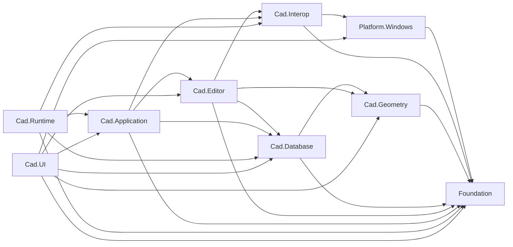

# Fs.Fox.CAD 单程序集逻辑模块化执行计划

> 状态：执行计划（Implementation Plan）<br>
> 基线：`main` @ `2ef03ce`，2026-08-01<br>
> 文档交付：本计划直接提交到 `main`；本次不创建或修改生产代码分支。<br>
> 后续实施分支：建议使用 `refactor/cadshared-logical-modularization`，从实施时最新 `origin/main` 创建并作为共享长期分支维护。<br>
> 原始参考：[Issue #18](https://github.com/FsDiG/Fs.Fox.CAD/issues/18)（仅作历史输入，不作为实施规格）<br>
> 可用性注记：2026-08-01 复核时 GitHub API 已无法解析 Issue #18，因此正文不依赖其内容。<br>
> 命名参考：[FeiSiDev/Fs.Zfgk.CAD](https://github.com/FeiSiDev/Fs.Zfgk.CAD) @ `c38ce32`（只参考领域词汇，不复制其目录层级）<br>
> SDK 依据：[AutoCAD 2026 Managed .NET Developer's Guide](https://help.autodesk.com/view/OARX/2026/ENU/?guid=GUID-C3F3C736-40CF-44A0-9210-55F6A939B6F2)（用于校正子系统边界，不采用厂商命名作为公共目录）<br>
> 跟踪 Issue：[Issue #25](https://github.com/FsDiG/Fs.Fox.CAD/issues/25)（与本计划同步维护）<br>
> 前序提案：[渐进式模块化重构建议](refactoring-proposal.md)（保留决策背景；单程序集目录迁移以本计划为准）<br>
> 审查基线：[Issue #42](https://github.com/FsDiG/Fs.Fox.CAD/issues/42)<br>
> 并行专项：[Issue #43](https://github.com/FsDiG/Fs.Fox.CAD/issues/43)

## 1. 结论

本轮只完成 `CADShared` 在**现有单程序集发布模型内**的逻辑模块化：

1. 96 个正式共享编译项全部归入 `Foundation`、`Platform.Windows`、`Cad.Interop`、`Cad.Database`、`Cad.Geometry`、`Cad.Editor`、`Cad.Application`、`Cad.Runtime` 或 `Cad.UI`。
2. 源码最终只保留 `Foundation`、`Platform`、`Cad` 三个所有权根目录，再按平台或 CAD SDK 子系统细分；公共命名空间、类型、成员和运行时行为保持不变。
3. `CADShared.projitems` 继续作为唯一共享编译入口；平台项目和测试项目的引用关系不变。
4. 本轮不按模块拆分 DLL，也不清理跨模块依赖。混合职责文件只整体移动并登记边界债务。
5. 先建立可机器校验的模块归属和编译顺序，再分批移动文件；每个移动批次只包含路径变化和对应的 MSBuild 路径更新。

完成后的目录结构是后续依赖清理的地图，不是已经证明依赖纯净的结论。

## 2. 范围与不变量

### 2.1 本轮处理

- `src/CADShared/CADShared.projitems` 当前列出的 96 个 `Compile` 项。
- 每个编译项的逻辑模块、稳定顺序和目标路径。
- `src/CADShared` 下的生产源码目录重排。
- 模块映射守卫和边界回归守卫，用于检查归属、数量、重复项、文件存在性、顺序及新增禁止依赖。
- 与新目录结构对应的维护者文档。

### 2.2 本轮不处理

- 不新增或拆分程序集、项目引用、NuGet 包或目标框架。
- 不修改 `Fs.Fox.Cad`、`Fs.Fox.Basal` 等公共命名空间。
- 不重命名公共类型、成员、文件名或 NuGet/程序集身份。
- 不修改 `DBTrans`、初始化、UI、P/Invoke 或其他生产代码行为。
- 不拆分 `EditorEx`、`Env`、`DBTrans`、`IFoxUtils`、`ProgramPE` 等大文件。
- 不清理 WPF、WinForms、CAD Windows、Editor 或 native interop 反向依赖。
- 不调整 `Directory.Build.props` 中的 WPF、WinForms、unsafe、nullable 或语言版本设置。
- 不移动或编译 `ExtensionMethod/Geometry/ToDo` 下的 21 个未编译文件。
- 不调整 `TestShared` 的目录、命令或宿主验收逻辑。
- 不夹带格式化、using 清理、注释重写或无关文档更新。

### 2.3 必须保持的不变量

| 兼容面 | 本轮要求 |
| --- | --- |
| 编译集合 | 以最近一次同步的 `origin/main` 为基线；本文快照为 96 个共享源码文件。单纯移动不得增删编译项，也不得意外纳入 ToDo 文件。 |
| 编译顺序 | 以最近一次同步的 `origin/main` 为基线；本文快照中 96 个 `Compile` 项的相对顺序保持不变。 |
| 公共 API | 公共类型、成员、签名、命名空间及可见性无变化。 |
| 程序集 | 仍输出 `Fs.Fox.AutoCad.dll` / `Fs.Fox.ZwCad.dll`。 |
| 包 | 四个正式 `IFox.CAD.*` 包 ID、依赖和包内布局无意外变化。 |
| 条件编译 | 现有 `#if/#elif` 内容及平台项目的 DefineConstants 不变。 |
| 行为 | 不修改任何 `.cs` 文件正文；纯路径移动不被当作行为修复。 |
| 测试结论 | 构建通过只记录为编译证据，不外推为 CAD 宿主通过。 |

## 3. 为什么首轮不拆分 `.projitems`

上级提案曾建议把 `CADShared.projitems` 拆成多个模块清单。当前代码审查发现，`AutoReflection.AppDomainGetTypes` 会使用 `Assembly.GetTypes()` 扫描初始化类型，再只按 `Sequence` 排序。同一 `Sequence` 内没有稳定的第二排序键，因此重新排列 C# `Compile` 输入可能改变元数据类型顺序，并进一步改变同优先级初始化的实际先后。

为避免把“清单整理”变成潜在运行时变化，本轮采用以下实现：

- 保留一个 `CADShared.projitems` 和当前 96 个 `Compile` 节点的相对顺序。
- 在每个 `Compile` 项上增加 `FsFoxModule` 和单调递增的 `FsFoxOrder` 元数据。
- 移动文件时只修改原节点的 `Include` 路径，不按模块重排节点。
- 不使用 `**/*.cs` 编译 glob；新文件、ToDo 文件或临时文件不能被隐式纳入。
- 只有后续先让初始化顺序具有明确稳定契约，并完成宿主验证后，才另行评估多个模块 `.items` 文件。

示意：

```xml
<Compile Include="$(MSBuildThisFileDirectory)Cad\Geometry\SpatialIndex\QuadTree\QuadEntity.cs">
  <FsFoxModule>Cad.Geometry</FsFoxModule>
  <FsFoxOrder>0010</FsFoxOrder>
</Compile>
```

`FsFoxOrder` 使用 10 为步长，允许未来在两个既有项之间显式插入新项。校验脚本只接受严格递增、唯一且非空的顺序值。

## 4. 目标边界与结构

### 4.1 第二轮边界结论

首轮的七个平铺目录可以表达大致职责，但不适合作为最终目标：`CadModel` 把持久化数据库对象和纯数学几何混在一起，`CadInteraction` 把 `ApplicationServices`、`EditorInput` 和命令运行时混在一起，`CadHosting` 又与 SDK 的 `Runtime` 概念重复。第二轮改为三个所有权根目录和九个逻辑模块：

1. `Foundation`：不感知 CAD 与 Windows 的通用代码。
2. `Platform/Windows`：操作系统专属能力。
3. `Cad/*`：按 CAD SDK 的职责子系统组织，但使用 AutoCAD/ZWCAD 都能理解的中性名称。

目录仍只回答“谁拥有这段代码”，不代表当前依赖已经纯净，也不直接对应未来 DLL。边界按以下规则确定：

1. **以主要状态和公共扩展目标归属。** 扩展 `Entity` 的文件进入 `Cad/Database/Entities`；扩展 `Editor`、Prompt、Selection 或 Jig 的文件进入 `Cad/Editor`。
2. **SDK 程序集不是源码模块。** `AcDbMgd.dll` 同时包含 `DatabaseServices` 与 `Geometry`，但持久化对象和数学几何的生命周期不同，仍应分开。
3. **运行中会话与程序集生命周期分开。** Document、系统变量和 Idle 属于 `Cad/Application`；`IExtensionApplication`、初始化发现和注册属于 `Cad/Runtime`。
4. **UI 与 Editor 分开。** 命令行、关键字输入、选择和 Jig 属于 Editor；对话框、状态栏、WPF/WinForms 窗口和首选项进入 `Cad/UI`。
5. **Interop 是受限技术边界。** 通用 Win32/PE 进入 `Platform/Windows`；可复用的 CAD native ABI 与第三方 ARX 桥接进入 `Cad/Interop`。功能专属 P/Invoke 仍由功能模块拥有并登记风险。
6. **目录不改变兼容面。** 本轮不让路径成为公共命名空间，不拆程序集，不重命名公共 API，不拆文件正文。

| 逻辑模块 | 拥有 | 明确不拥有 |
| --- | --- | --- |
| `Foundation` | 纯 BCL 集合、枚举、Guard、兼容辅助 | CAD SDK、Win32、宿主状态 |
| `Platform.Windows` | Win32 声明、Windows 结构、PE 文件解析 | CAD SDK、Editor 流程、CAD 功能 |
| `Cad.Interop` | CAD native ABI、宿主导出解析适配、第三方 ARX 接口 | 数据库规则、交互流程、窗口、初始化编排 |
| `Cad.Geometry` | 点、向量、曲线数学、坐标运算、空间索引 | DWG 所有权、事务、当前 Document/Editor、UI |
| `Cad.Database` | Database、DBObject/Entity、事务、符号表、字典、关联、XData/XRecord、Xref、DWG 文件能力 | 当前会话、Editor 输入、桌面 UI、程序集加载 |
| `Cad.Editor` | Editor、Prompt/关键字输入、Selection、Jig、命令派发、编辑器显示刷新 | 桌面窗口、状态栏、程序集注册、全局会话所有权 |
| `Cad.Application` | Application、Document、DocumentLock、系统变量、Idle 调度、当前会话上下文 | 程序集发现/注册、数据库规则、桌面控件 |
| `Cad.Runtime` | `IExtensionApplication`、初始化发现、注册、LISP 运行时数据 | 一般 Document/Editor 流程、桌面 UI、数据库业务 |
| `Cad.UI` | CAD 对话框、WPF/WinForms 窗口、状态栏、错误呈现、首选项 | 数据库语义、事务所有权、程序集加载策略 |

`Autodesk.AutoCAD.GraphicsInterface` 是真实的 SDK 子系统，但 Fox 当前没有足够内聚的独立图形服务：`RedrawEx` 的公共入口仍是 `Editor`/`Entity`，瞬态绘制服务属于 Jig 工作流，而 `GeometryEx` 中少量 `Drawable` 方法还是待拆债务。因此首轮不创建只有一个所有者文件的 `Cad/Graphics` 模块；`RedrawEx` 先放入 `Cad/Editor/Display`。出现可复用的 Drawable、Overrule、Transient 或 World/ViewportDraw 服务后，再以独立 Issue 评估提升为 `Cad/Graphics`。

### 4.2 ObjectARX / Managed .NET 证据

| 官方证据 | 对本计划的约束 |
| --- | --- |
| [Components of the AutoCAD .NET API](https://help.autodesk.com/view/OARX/2026/ENU/?guid=GUID-8657D153-0120-4881-A3C8-E00ED139E0D3) | Autodesk 将 `AcCoreMgd` 描述为 Editor/Plot/命令能力，将 `AcDbMgd` 描述为图形文件内对象，将 `AcMgd` 描述为 Application/UI；证明“模型/交互”两个宽桶过粗，但 DLL 本身也不能直接当目录。 |
| [`DatabaseServices`](https://help.autodesk.com/view/OARX/2026/ENU/?guid=OARX-ManagedRefGuide-Autodesk_AutoCAD_DatabaseServices) 与 [Database Object](https://help.autodesk.com/view/OARX/2026/ENU/?guid=GUID-7313ECA1-4875-4946-82E3-C06A4074F807) | Database 拥有实体、符号表、字典等 DWG 对象；`Entity`、Hatch、Xref、ResultData 和事务应归入 `Cad/Database`。 |
| [`Entity : DBObject`](https://help.autodesk.com/view/OARX/2026/ENU/?guid=OARX-ManagedRefGuide-Autodesk_AutoCAD_DatabaseServices_Entity) 与 [`SymbolTable : DBObject`](https://help.autodesk.com/view/OARX/2026/ENU/?guid=OARX-ManagedRefGuide-Autodesk_AutoCAD_DatabaseServices_SymbolTable) | `Entities` 和 `SymbolTables` 是 Database 内部的类型族，不应与 Database 并列为顶层模块。 |
| [`Geometry`](https://help.autodesk.com/view/OARX/2026/ENU/?guid=OARX-ManagedRefGuide-Autodesk_AutoCAD_Geometry) | AcGe 包装类型是数学点、曲线、曲面和相交运算；与受事务和 ObjectId 管理的 DBObject 生命周期不同。 |
| [`EditorInput`](https://help.autodesk.com/view/OARX/2026/ENU/?guid=OARX-ManagedRefGuide-Autodesk_AutoCAD_EditorInput) | Editor、Prompt、SelectionSet/Filter、`Jig -> DrawJig/EntityJig` 属于同一输入/交互子系统。 |
| [`ApplicationServices`](https://help.autodesk.com/view/OARX/2026/ENU/?guid=OARX-ManagedRefGuide-Autodesk_AutoCAD_ApplicationServices) | Application 是 API 根对象，Document、DocumentCollection 和 DocumentLock 属于运行中应用会话。 |
| [`Runtime`](https://help.autodesk.com/view/OARX/2026/ENU/?guid=OARX-ManagedRefGuide-Autodesk_AutoCAD_Runtime) | 命令/LISP 标记、动态加载、`ExtensionApplicationAttribute` 与 `IExtensionApplication` 属于运行时加载契约。 |
| [`GraphicsInterface`](https://help.autodesk.com/view/OARX/2026/ENU/?guid=OARX-ManagedRefGuide-Autodesk_AutoCAD_GraphicsInterface) | AcGi Drawable、World/ViewportDraw、Traits 和 Transient 是独立概念；当前先记录边界，不因零散调用预建空模块。 |
| [`AutoCAD.Windows`](https://help.autodesk.com/view/OARX/2026/ENU/?guid=OARX-ManagedRefGuide-Autodesk_AutoCAD_Windows) | Palette、Pane、StatusBar、TrayItem 和 CAD 对话框属于 UI，不属于 EditorInput。 |
| [Transaction Manager](https://help.autodesk.com/view/OARX/2026/ENU/?guid=GUID-12ADA0F2-C44D-4D88-B248-1803D39DF3AA) | Transaction 管理 DBObject 的打开、变更、提交和释放；`DBTrans` 即使暴露 Document/Editor，也仍以事务所有权为主。 |

本地证据与官方划分一致：[AutoCAD GlobalUsings](../src/IFoxCAD.AutoCad/GlobalUsings.cs) 和 [ZWCAD GlobalUsings](../src/IFoxCAD.ZwCad/GlobalUsings.cs) 都并列暴露 `ApplicationServices`、`DatabaseServices`、`EditorInput`、`Geometry`、`GraphicsInterface`、`Runtime` 与 `Windows`。AutoCAD 2025 NuGet 又把 drawing object model、core object model 和 UI 分包，而 ZWCAD 2025 仍采用不同程序集组合；所以目录采用中性子系统名，不采用 `ObjectARX/AcDb/AcEd` 或 Autodesk 的物理 DLL 名。

### 4.3 目标目录

```text
src/CADShared/
  Foundation/
    Compatibility/
  Platform/
    Windows/
      Interop/
      PortableExecutable/
  Cad/
    Interop/
      Native/
      ThirdParty/
        Tianzheng/
    Geometry/
      SpatialIndex/
        QuadTree/
    Database/
      Associativity/
      Collections/
      Dictionaries/
      Entities/
        Blocks/
        Bounds/
        Curves/
          Polylines/
        Hatch/
        Text/
      Files/
      Objects/
      ResultData/
      SymbolTables/
      Transactions/
      Xrefs/
    Editor/
      Commands/
      Display/
      Input/
      Jig/
      Selection/
        Filters/
    Application/
      Context/
      Documents/
      Scheduling/
      SystemVariables/
    Runtime/
      Initialization/
      Lisp/
      Registration/
    UI/
      Dialogs/
      Preferences/
      StatusBar/
      Windows/
  ExtensionMethod/Geometry/ToDo/   # 原样保留且不参与编译
  CADShared.projitems
  CADShared.shproj
```

三层不是为了追求目录深度，而是避免九个平铺顶层目录失去共同语境。`Cad/Database/Entities/Curves/Polylines` 这一级只用于已经形成明确类型族的文件；不会为每个单独类型机械创建目录。`Cad/UI` 下暂时不建立 `Common`、`Shell` 或 `Utilities`，混合文件 `IFoxUtils.cs` 直接留在 `Cad/UI` 根并登记拆分债务，比用模糊目录掩盖问题更诚实。

### 4.4 类层级与文件组织

目标目录遵循 SDK 的所有权/继承层级，而不是把所有 `*Ex` 平铺在一起：

```text
DatabaseServices.DBObject
├─ Entity
│  ├─ Curve
│  │  ├─ Arc / Circle
│  │  └─ Polyline
│  ├─ BlockReference
│  ├─ DBText / MText
│  ├─ Hatch
│  └─ Region
├─ SymbolTable
└─ SymbolTableRecord

EditorInput.Jig
├─ DrawJig       <- Fox JigEx
└─ EntityJig

Fox TypedValueList
├─ XDataList
├─ XRecordDataList
└─ LispList      <- 继承关系保留，但所有权在 Cad/Runtime/Lisp

Fox OpFilter
├─ OpEqual
│  └─ OpComp
└─ OpLogi
   ├─ OpList
   │  ├─ OpAnd
   │  └─ OpOr
   ├─ OpNot
   └─ OpXor

Fox Rect
└─ QuadEntity

Runtime.IExtensionApplication
└─ Fox AutoRegAssem

对象所有权/包装关系（不是继承）
Application
└─ DocumentCollection
   └─ Document
      ├─ Database
      ├─ Editor
      └─ DocumentLock <- Fox DocumentLockManager owns

Database
└─ TransactionManager
   └─ Transaction <- Fox DBTrans owns/wraps

Fox QuadTree<TEntity>
└─ generic constraint: TEntity : QuadEntity

Fox SymbolTable<TTable, TRecord>
└─ generic constraint: TTable : SDK SymbolTable
```

据此采用以下文件规则：

1. 扩展类与被扩展的 SDK 类型族放在一起，例如 `ArcEx` 放在 `Entities/Curves`，`ObjectIdEx` 放在 `Database/Objects`，不建立统一 `ExtensionMethod` 根目录。
2. Fox 包装类按它拥有的资源归属。`DBTrans` 不是 SDK `Transaction` 的派生类，但拥有 Transaction/Database 生命周期，因此留在 `Database/Transactions`；`DocumentLockManager` 拥有 DocumentLock，因此进入 `Application/Documents`。
3. 算法按输入模型归属。QuadTree 只依赖几何边界，不拥有 DBObject/ObjectId/Transaction，因此进入 `Geometry/SpatialIndex`，不进入 `Database/Entities`。
4. 一个文件包含多个公开类型时，本轮仍整体移动；后续拆文件必须保持原公共类型、命名空间和二进制兼容，不能夹带重命名。
5. 新增文件原则上“一项主要公开类型一个文件”，文件名与主要类型名一致；私有/内部辅助类型只有在不独立复用时才与所有者同文件。

需要在目录稳定后单独处理的类级组织如下：

| 当前文件/类型 | 目录阶段的处理 | 后续类级建议（不属于本轮） |
| --- | --- | --- |
| `Enums.cs` | 整体放入 `Cad/Database`，登记混合归属 | 按现有类型拆到 `Xrefs`、`SymbolTables`、`Geometry`、`Entities/Text`；先不改公开枚举名。 |
| `CollectionEx` | 放入 `Cad/Database/Collections` | 分离 DBObject/ObjectId、Geometry collection、Editor KeywordCollection 与纯 `IEnumerable` 扩展；兼容入口保留在原类型。 |
| `GeometryEx` | 放入 `Cad/Geometry` | 分离纯几何、显式坐标变换、当前 Editor 坐标系和 GraphicsInterface Draw 扩展。 |
| `Env` | 放入 `Cad/Application/Context` | 按 Document/Database/Editor 会话访问、系统变量、宿主版本与 native 查询拆窄服务；`Env` 只作为兼容外观。 |
| `IFoxUtils` | 直接放入 `Cad/UI` 根 | 分为图层显示刷新、Tray 通知、双击编辑控制和 Transparency 转换；不再使用 `Utils/Shell` 兜底。 |
| `IAutoGo.cs` | 放入 `Cad/Runtime/Initialization` | 将 `IFoxAutoGo`、`IFoxInitializeAttribute`、运行描述和反射协调器拆成同名文件。 |
| `PostCmd` | 放入 `Cad/Editor/Commands` | 后续以 `CadCommandDispatcher`/兼容外观表达职责；保留 native 导出字段名与旧公共入口。 |
| `SingleKeyWordHook` | 放入 `Cad/Editor/Input` | 保留关键字输入职责；把 WinForms Keys/消息预处理封装成宿主输入适配，避免扩散到其他 Editor 文件。 |
| `ErrorInfoEx` | 放入 `Cad/UI/Dialogs` | 后续分离 ErrorStatus 文本映射与 `ShowAlertDialog` 呈现；映射层不得反向依赖 UI。 |
| `Op*.cs` | 保持现有公开层级并进入 `Editor/Selection/Filters` | 先拆成一公开类型一文件；是否引入更完整名称必须走公共 API 兼容评审。 |

`*Util` 不是本项目的目标命名风格。现有 `*Ex` 表示 SDK 类型的扩展伴随类时可保留；拥有状态或生命周期的类型应使用角色名，例如 `...Context`、`...Dispatcher`、`...Scope` 或具体资源名，而不是继续增加 `Util/Helper/Manager`。

### 4.5 目标依赖方向

下图表示依赖清理阶段完成后的允许方向，箭头含义为“左侧模块可以依赖右侧模块”。它不是当前源码已经满足的声明。



目标中不存在 `Cad.Geometry -> Cad.Database/Application/Editor/UI`、`Cad.Database -> Cad.Application/Editor/Runtime/UI`、`Cad.Editor -> Cad.Application/Runtime/UI` 或 `Platform.Windows -> CAD SDK`。当前 `GeometryEx -> Env`、`DatabaseEx -> DocumentManager/MessageBox`、`EditorEx -> WinForms/native`、Idle 调度对 WinForms Cursor 的依赖等都违反目标方向，只能作为已编号债务保留。

这里的“依赖”指 Fox 模块之间的源码调用，不是仅因方法签名出现一个 SDK 类型就认定依赖另一个 Fox 模块。例如 `Cad.Application` 可以返回 SDK `Editor`，但不应因此调用 `Cad.Editor` 中的高层扩展；守卫最终应以 Roslyn 符号所属的 Fox 源文件判断，而不是简单扫描 Autodesk/ZwSoft namespace。

### 4.6 参考 Fs.Zfgk.CAD 后的命名取舍

`Fs.Zfgk.CAD` 提供了直观领域词汇，但它是 AutoCAD 专属，并存在 `Other/Others/ArxOthers` 等兜底目录。本计划只借鉴可验证的职责表达：

| 参考名称 | 本计划取舍 | 理由 |
| --- | --- | --- |
| `Geometry` | 采用 `Cad/Geometry` | 与 AcGe/Managed `Geometry` 数学对象一致，并与 DBObject 生命周期分开。 |
| `ObjectARX/Entity` | 采用 `Cad/Database/Entities` | 官方层级是 `DBObject -> Entity`；同时支持 ZWCAD，不能采用 `ObjectARX` 厂商根名。 |
| `ObjectARX/Interaction` | 拆为 `Cad/Editor`、`Cad/Application`、`Cad/UI` | Selection/Jig、Document/Idle、桌面窗口具有不同所有权和依赖方向，不能继续合成一个 Interaction 桶。 |
| `ObjectARX/SpacialIndex` | 纠正拼写并采用 `Cad/Geometry/SpatialIndex/QuadTree` | 当前 QuadTree 输入是几何矩形，不拥有数据库事务或 ObjectId。 |
| `ObjectARX/DwgTable` | 不采用；SDK SymbolTable 放入 `Cad/Database/SymbolTables` | 参考仓库的 DwgTable 是绘图表格/单元格渲染，不等于数据库 SymbolTable 类型族。 |
| `UI` | 采用 `Cad/UI`，但明确排除 EditorInput | Fox 的对话框、Pane、StatusBar、Window 和 Hook 能形成 UI 边界。 |
| `Other`、`Others`、`ArxOthers` | 不采用 | 无法归属的文件保留在最近的明确所有者根并登记债务，不创建兜底目录。 |
| `*Util` | 不照搬 | SDK 扩展继续使用 `*Ex`；有状态/生命周期的类使用具体角色名，重命名另走兼容阶段。 |

因此，最终结构既参考 `Fs.Zfgk.CAD` 的领域可发现性，也受 ObjectARX/.NET 的真实层级约束；它不是任一参考仓库或 Autodesk 程序集布局的复制品。

## 5. 模块清单

| 模块 | 编译项数 | 当前主要内容 | 当前边界状态 |
| --- | ---: | --- | --- |
| `Foundation` | 9 | 通用集合、枚举、循环、Guard、随机数 | 当前 9 个文件未发现 CAD、Windows UI 或 native 依赖。 |
| `Platform.Windows` | 5 | Win32 声明、Windows 辅助、PE 文件解析 | 当前未引用 CAD SDK；以平台风险而非 CAD 领域隔离。 |
| `Cad.Interop` | 3 | CAD native bridge、PE 导出解析适配、天正接口 | 所有权清楚，但 ABI、宿主版本和第三方模块可用性风险高。 |
| `Cad.Geometry` | 10 | AcGe 风格曲线/点运算、坐标变换、QuadTree | `GeometryEx` 仍读取当前 Editor 并含 GraphicsInterface 扩展。 |
| `Cad.Database` | 35 | DBObject/Entity、关联、事务、符号表、字典、ResultData、Xref、DWG 文件 | 主体数据库模块；仍存在 Application/Editor 反向依赖和混合枚举文件。 |
| `Cad.Editor` | 13 | Editor、命令派发、Prompt/关键字输入、Selection、Jig、显示刷新 | `EditorEx`/`PostCmd`/`SingleKeyWordHook`/`RedrawEx` 仍泄漏 Application、WinForms 或 native 细节。 |
| `Cad.Application` | 6 | 当前会话、DocumentLock、系统变量、Idle 调度 | `Env` 过大；Idle 调度仍依赖 WinForms Cursor。 |
| `Cad.Runtime` | 8 | LISP 数据、自动注册、初始化反射、加载与终止入口 | 与宿主加载紧密相关；仍有 MessageBox、原生内存操作和多类型文件。 |
| `Cad.UI` | 7 | CAD 对话框、错误呈现、状态栏、窗口、首选项 | UI 边界基本明确，`IFoxUtils` 仍为混合职责文件。 |
| **总计** | **96** |  | 必须与 `CADShared.projitems` 一致。 |

## 6. 完整路径映射

以下映射是本轮的文件级事实来源。左侧为当前相对 `src/CADShared` 的路径，右侧为目标路径。文件名和文件正文不变。

### 6.1 Foundation（9）

```text
Basal/General/ArrayEx.cs -> Foundation/ArrayEx.cs
Basal/General/DebugHelper.cs -> Foundation/DebugHelper.cs
Basal/General/EnumEx.cs -> Foundation/EnumEx.cs
Basal/General/LinqEx.cs -> Foundation/LinqEx.cs
Basal/General/LoopList.cs -> Foundation/LoopList.cs
Basal/General/LoopState.cs -> Foundation/LoopState.cs
Basal/Nullable/ArgumentNullEx.cs -> Foundation/Compatibility/ArgumentNullEx.cs
Basal/Nullable/CallerArgumentExpressionAttribute.cs -> Foundation/Compatibility/CallerArgumentExpressionAttribute.cs
ExtensionMethod/RandomEx.cs -> Foundation/RandomEx.cs
```

### 6.2 Platform.Windows（5）

```text
Basal/Win/Enums.cs -> Platform/Windows/Interop/Enums.cs
Basal/Win/PInvokeUser32.cs -> Platform/Windows/Interop/PInvokeUser32.cs
Basal/Win/SystemEx.cs -> Platform/Windows/Interop/SystemEx.cs
Basal/Win/WindowsAPI.cs -> Platform/Windows/Interop/WindowsAPI.cs
PE/ProgramPE.cs -> Platform/Windows/PortableExecutable/ProgramPE.cs
```

### 6.3 Cad.Interop（3）

```text
ExtensionMethod/TangentEx.cs -> Cad/Interop/ThirdParty/Tianzheng/TangentEx.cs
PE/AcadPeInfo.cs -> Cad/Interop/Native/AcadPeInfo.cs
Runtime/PInvokeCad.cs -> Cad/Interop/Native/PInvokeCad.cs
```

### 6.4 Cad.Geometry（10）

```text
Algorithms/QuadTree/QuadEntity.cs -> Cad/Geometry/SpatialIndex/QuadTree/QuadEntity.cs
Algorithms/QuadTree/QuadTree.cs -> Cad/Geometry/SpatialIndex/QuadTree/QuadTree.cs
Algorithms/QuadTree/QuadTreeEvn.cs -> Cad/Geometry/SpatialIndex/QuadTree/QuadTreeEvn.cs
Algorithms/QuadTree/QuadTreeNode.cs -> Cad/Geometry/SpatialIndex/QuadTree/QuadTreeNode.cs
Algorithms/QuadTree/QuadTreeSelectMode.cs -> Cad/Geometry/SpatialIndex/QuadTree/QuadTreeSelectMode.cs
Algorithms/QuadTree/Rect.cs -> Cad/Geometry/SpatialIndex/QuadTree/Rect.cs
ExtensionMethod/Geometry/Curve2dEx.cs -> Cad/Geometry/Curve2dEx.cs
ExtensionMethod/Geometry/Curve3dEx.cs -> Cad/Geometry/Curve3dEx.cs
ExtensionMethod/Geometry/GeometryEx.cs -> Cad/Geometry/GeometryEx.cs
ExtensionMethod/Geometry/PointEx.cs -> Cad/Geometry/PointEx.cs
```

### 6.5 Cad.Database：实体类型族（15）

```text
ExtensionMethod/BulgeVertexWidth.cs -> Cad/Database/Entities/Curves/Polylines/BulgeVertexWidth.cs
ExtensionMethod/Entity/ArcEx.cs -> Cad/Database/Entities/Curves/ArcEx.cs
ExtensionMethod/Entity/BlockReferenceEx.cs -> Cad/Database/Entities/Blocks/BlockReferenceEx.cs
ExtensionMethod/Entity/BoundingBox9.cs -> Cad/Database/Entities/Bounds/BoundingBox9.cs
ExtensionMethod/Entity/CircleEx.cs -> Cad/Database/Entities/Curves/CircleEx.cs
ExtensionMethod/Entity/CurveEx.cs -> Cad/Database/Entities/Curves/CurveEx.cs
ExtensionMethod/Entity/DBTextEx.cs -> Cad/Database/Entities/Text/DBTextEx.cs
ExtensionMethod/Entity/EntityBoundingInfo.cs -> Cad/Database/Entities/Bounds/EntityBoundingInfo.cs
ExtensionMethod/Entity/EntityEx.cs -> Cad/Database/Entities/EntityEx.cs
ExtensionMethod/Entity/MTextEx.cs -> Cad/Database/Entities/Text/MTextEx.cs
ExtensionMethod/Entity/PolylineEx.cs -> Cad/Database/Entities/Curves/Polylines/PolylineEx.cs
ExtensionMethod/Entity/RegionEx.cs -> Cad/Database/Entities/RegionEx.cs
ExtensionMethod/Hatch/HatchConverter.cs -> Cad/Database/Entities/Hatch/HatchConverter.cs
ExtensionMethod/Hatch/HatchEx.cs -> Cad/Database/Entities/Hatch/HatchEx.cs
ExtensionMethod/Hatch/HatchInfo.cs -> Cad/Database/Entities/Hatch/HatchInfo.cs
```

### 6.6 Cad.Database：集合、结果数据与文件（5）

```text
ExtensionMethod/CollectionEx.cs -> Cad/Database/Collections/CollectionEx.cs
ExtensionMethod/DwgMark.cs -> Cad/Database/Files/DwgMark.cs
ResultData/TypedValueList.cs -> Cad/Database/ResultData/TypedValueList.cs
ResultData/XDataList.cs -> Cad/Database/ResultData/XDataList.cs
ResultData/XRecordDataList.cs -> Cad/Database/ResultData/XRecordDataList.cs
```

### 6.7 Cad.Database：核心对象、关联与事务（15）

```text
Assoc/AssocPersSubentityIdPEEx.cs -> Cad/Database/Associativity/AssocPersSubentityIdPEEx.cs
Assoc/AssocUtils.cs -> Cad/Database/Associativity/AssocUtils.cs
ExtensionMethod/Enums.cs -> Cad/Database/Enums.cs
ExtensionMethod/BaseEx.cs -> Cad/Database/SymbolTables/BaseEx.cs
ExtensionMethod/DatabaseEx.cs -> Cad/Database/DatabaseEx.cs
ExtensionMethod/DBDictionaryEx.cs -> Cad/Database/Dictionaries/DBDictionaryEx.cs
ExtensionMethod/DBObjectEx.cs -> Cad/Database/Objects/DBObjectEx.cs
ExtensionMethod/DBTransEx.cs -> Cad/Database/Transactions/DBTransEx.cs
ExtensionMethod/ObjectIdEx.cs -> Cad/Database/Objects/ObjectIdEx.cs
ExtensionMethod/SymbolTableEx.cs -> Cad/Database/SymbolTables/SymbolTableEx.cs
ExtensionMethod/SymbolTableRecordEx.cs -> Cad/Database/SymbolTables/SymbolTableRecordEx.cs
ExtensionMethod/TransactionEx.cs -> Cad/Database/Transactions/TransactionEx.cs
ExtensionMethod/XrefEx.cs -> Cad/Database/Xrefs/XrefEx.cs
Runtime/DBTrans.cs -> Cad/Database/Transactions/DBTrans.cs
Runtime/SymbolTable.cs -> Cad/Database/SymbolTables/SymbolTable.cs
```

### 6.8 Cad.Editor（13）

```text
PE/PostCmd.cs -> Cad/Editor/Commands/PostCmd.cs
ExtensionMethod/EditorEx.cs -> Cad/Editor/EditorEx.cs
ExtensionMethod/PromptOptionsEx.cs -> Cad/Editor/PromptOptionsEx.cs
ExtensionMethod/SingleKeyWordHook.cs -> Cad/Editor/Input/SingleKeyWordHook.cs
ExtensionMethod/Jig/JigEx.cs -> Cad/Editor/Jig/JigEx.cs
ExtensionMethod/Jig/JigExTransient.cs -> Cad/Editor/Jig/JigExTransient.cs
ExtensionMethod/RedrawEx.cs -> Cad/Editor/Display/RedrawEx.cs
ExtensionMethod/SelectionSetEx.cs -> Cad/Editor/Selection/SelectionSetEx.cs
SelectionFilter/OpComp.cs -> Cad/Editor/Selection/Filters/OpComp.cs
SelectionFilter/OpEqual.cs -> Cad/Editor/Selection/Filters/OpEqual.cs
SelectionFilter/OpFilter.cs -> Cad/Editor/Selection/Filters/OpFilter.cs
SelectionFilter/OpList.cs -> Cad/Editor/Selection/Filters/OpList.cs
SelectionFilter/OpLogi.cs -> Cad/Editor/Selection/Filters/OpLogi.cs
```

### 6.9 Cad.Application（6）

```text
PE/DBmod.cs -> Cad/Application/SystemVariables/DBmod.cs
Runtime/Env.cs -> Cad/Application/Context/Env.cs
Runtime/SystemVariableManager.cs -> Cad/Application/SystemVariables/SystemVariableManager.cs
ExtensionMethod/DocumentLockManager.cs -> Cad/Application/Documents/DocumentLockManager.cs
Runtime/IdleAction.cs -> Cad/Application/Scheduling/IdleAction.cs
Runtime/IdleNoCommandAction.cs -> Cad/Application/Scheduling/IdleNoCommandAction.cs
```

### 6.10 Cad.Runtime（8）

```text
ResultData/LispList.cs -> Cad/Runtime/Lisp/LispList.cs
Initialize/AcadEMR.cs -> Cad/Runtime/Initialization/AcadEMR.cs
Initialize/CheckFactory.cs -> Cad/Runtime/Initialization/CheckFactory.cs
Initialize/IAutoGo.cs -> Cad/Runtime/Initialization/IAutoGo.cs
Initialize/MethodInfoHelper.cs -> Cad/Runtime/Initialization/MethodInfoHelper.cs
Initialize/AssemInfo.cs -> Cad/Runtime/Registration/AssemInfo.cs
Initialize/AutoReg.cs -> Cad/Runtime/Registration/AutoReg.cs
Initialize/AutoRegAssem.cs -> Cad/Runtime/Registration/AutoRegAssem.cs
```

### 6.11 Cad.UI（7）

```text
ExtensionMethod/Hatch/HatchDialog.cs -> Cad/UI/Dialogs/HatchDialog.cs
ExtensionMethod/ErrorInfoEx.cs -> Cad/UI/Dialogs/ErrorInfoEx.cs
Runtime/AcPreferences.cs -> Cad/UI/Preferences/AcPreferences.cs
ExtensionMethod/IFoxUtils.cs -> Cad/UI/IFoxUtils.cs
ExtensionMethod/PaneEx.cs -> Cad/UI/StatusBar/PaneEx.cs
Runtime/ProgressMeterUtils.cs -> Cad/UI/StatusBar/ProgressMeterUtils.cs
ExtensionMethod/WindowEx.cs -> Cad/UI/Windows/WindowEx.cs
```

## 7. 已知边界债务

初始归属按文件的**主要职责**确定，不宣称现有依赖已经符合目标方向。以下问题只登记，不在移动提交组中修复：

| 编号 | 初始归属 | 文件 | 当前证据或风险 | 后续方向 |
| --- | --- | --- | --- | --- |
| `BD-01` | `Cad.Database` | `CollectionEx.cs` | 同时扩展 Database/Geometry collection、纯 `IEnumerable` 和 EditorInput `KeywordCollection`。 | 后续按公共 API 兼容方案拆文件。 |
| `BD-02` | `Cad.Database` | `DatabaseEx.cs` | 访问 DocumentManager，并直接调用 WinForms MessageBox。 | 将提示策略与数据库保存逻辑分离。 |
| `BD-03` | `Cad.Database` | `DBTrans.cs` | 公开 Document、Editor、DocumentLock，并包含视图恢复。 | 继续由 #43 定义生命周期；本轮不拆。 |
| `BD-04` | `Cad.Geometry` | `GeometryEx.cs` | UCS/WCS 方法读取 `Env.Editor`，并含 GraphicsInterface `Drawable` 绘制扩展。 | 分离纯几何、显式坐标变换、当前 Editor 适配和 GraphicsInterface 扩展。 |
| `BD-05` | `Cad.Database` | `HatchEx.cs`、`HatchInfo.cs` | 错误路径直接通过 `Env.Editor`/`Env.Print` 输出消息。 | 让模型操作返回/抛出结构化结果，由调用方提示。 |
| `BD-06` | `Cad.Database` | `SymbolTableRecordEx.cs` | 通过 `DBTrans.Editor` 输出块定义错误。 | 分离查询结果与命令行提示。 |
| `BD-07` | `Cad.Editor` | `EditorEx.cs` | 同时包含 Editor API、WinForms MessageBox 和 native 调用。 | 按 Editor、UI notification、native command 分拆。 |
| `BD-08` | `Cad.Editor` | `RedrawEx.cs` | 重绘流程调用 WinForms `Application.DoEvents()`。 | 单独评估消息泵和宿主重绘契约。 |
| `BD-09` | `Cad.Application` | `Env.cs` | 混合 Database、Document/Editor、配置、系统变量和 PInvokeCad。 | 按能力逐段迁移，不整类重写。 |
| `BD-10` | `Cad.UI` | `IFoxUtils.cs` | 同时包含图层重生成、状态栏气泡、鼠标双击控制和透明度转换。 | 按类级建议拆开，`IFoxUtils` 保留兼容外观。 |
| `BD-11` | `Cad.Runtime` | `CheckFactory.cs` | 初始化检查直接显示 WinForms MessageBox。 | 引入窄错误报告策略或交给消费方。 |
| `BD-12` | `Cad.Application` | Idle 调度文件 | 任务队列属于应用会话，但用 WinForms Cursor 自赋值触发/刷新宿主状态。 | 保留在 `Scheduling`，另行用宿主验证确定消息泵适配方式。 |
| `BD-13` | `Cad.Runtime` | `AcadEMR.cs` | 初始化选项会定位 native 导出、修改内存页权限并写入函数体。 | 作为独立的高风险宿主能力审查，不并入通用 Interop，也不在移动提交组中修改。 |
| `BD-14` | `Cad.Interop` | `AcadPeInfo.cs`、`PInvokeCad.cs`、`TangentEx.cs` | 依赖模块名、导出符号、宿主版本或可选第三方 ARX；失败边界并不统一。 | 为每个桥接建立宿主/版本能力探测和失败契约，禁止继续堆入普通功能。 |
| `BD-15` | `Platform.Windows` | `ProgramPE.cs`、Win32 文件 | 当前没有 CAD SDK 依赖，但包含大型 PE 解析器、广泛 P/Invoke 和可变低层结构。 | 保持叶子依赖边界，后续分别审查 API 面、unsafe/内存所有权和解析健壮性。 |
| `BD-16` | `Cad.Database` | `Associativity` 文件 | `AssocUtils` 仅在 ACAD 编译，另一个扩展也受版本条件限制，不能假定多宿主能力对等。 | 记录 AutoCAD/ZWCAD 能力矩阵；目录归属不代表跨宿主一致。 |
| `BD-17` | `Cad.Database` | `BlockReferenceEx.cs` | 部分方法从 `Env.Database` 获取顶层事务，并通过 `Env.EntGet` 读取 native 数据。 | 让调用者显式提供事务/数据库，并把 native 查询适配移到应用或互操作边界。 |
| `BD-18` | `Cad.Database` | `DBTextEx.cs` | 未传入数据库时回退到进程级 `HostApplicationServices.WorkingDatabase`。 | 保留兼容重载，新增显式数据库路径并逐步减少隐式全局状态。 |
| `BD-19` | `Cad.Database` | `Enums.cs` | 同一文件混合 Xref、SymbolTable、Geometry、Region 和字体枚举，没有单一准确目录。 | 初始整体移动；目录稳定后按公开类型拆文件，不在拆分时重命名。 |
| `BD-20` | `Cad.Runtime` | `IAutoGo.cs` | 同时声明初始化接口、Attribute、运行描述和反射协调器。 | 先按现有公开类型拆成同名文件，再讨论角色命名。 |
| `BD-21` | `Cad.Editor` | `SingleKeyWordHook.cs` | 关键字输入通过 Application `PreTranslateMessage`、WinForms Keys 和内部焦点 API 实现。 | 保留在 `Editor/Input`，后续封装宿主输入适配并验证 AutoCAD/ZWCAD 消息契约。 |
| `BD-22` | `Cad.Editor` | `PostCmd.cs` | 同一类型混合同步/异步命令派发、Application context、COM 和 native 导出调用。 | 分离高层命令派发与各宿主执行适配；保留旧入口和导出字段名。 |
| `BD-23` | `Cad.UI` | `ErrorInfoEx.cs` | ErrorStatus 文本映射与 `ShowAlertDialog` 呈现耦合。 | 将纯错误映射下沉，UI 只负责呈现；保持现有内部扩展入口。 |

## 8. 长期实施分支与阶段检查点

本计划文档直接进入 `main`，让后续产品迭代在修改 `CADShared` 时可以看到目标归属；本次交付不创建实施分支，也不移动源码。真正开始实施时，从当时最新的 `origin/main` 创建一个共享长期分支，建议命名为 `refactor/cadshared-logical-modularization`。Phase A 至 Phase D 都在这个分支内完成，只作为可审查的提交组和验收检查点，不再为每个移动批次创建短期分支并串行合入 `main`。

### 8.1 两条并行轨道

| 轨道 | 负责内容 | 合入策略 |
| --- | --- | --- |
| `main` | 正常功能、缺陷修复、发布和必要文档；继续拥有最新生产行为。 | 按现有节奏持续合入，不等待目录重构。 |
| `refactor/cadshared-logical-modularization` | 本计划的映射守卫、机械移动、兼容性基线和必要的迁移记录。 | 共享并长期维护，完成全部最终门槛后才考虑合回 `main`。 |

并行期间遵循以下规则：

1. 长期分支一旦由多人共享，只通过 `git merge origin/main` 吸收主线，不 rebase，不强推改写公共历史。
2. 至少每周同步一次 `origin/main`，并在每个 Phase 开始前、检查点确认前再次同步。只要 `main` 修改了 `src/CADShared` 下的映射文件、源码或项目清单，应立即同步，不等到下一固定周期。
3. 合并冲突先保留 `main` 的最新生产行为，再重新应用目标路径和映射元数据；不得用长期分支中的旧文件覆盖主线修复。
4. 每次同步后重新读取 `CADShared.projitems`。如果 `main` 合法新增、删除或重命名编译项，应在长期分支中更新本计划的逐文件映射、模块计数、`FsFoxOrder` 基线和守卫期望值，并记录对应的 `main` 提交；本文的 96 项和 `9 / 5 / 3 / 10 / 35 / 13 / 6 / 8 / 7` 是 `2ef03ce` 快照，不是阻止主线演进的永久常量。
5. `main` 上涉及已映射文件的 PR 应在描述中注明当前路径、计划模块/目标路径以及是否增删编译项，并避免夹带目录搬迁、全文件格式化或无关重命名。紧急缺陷仍先在 `main` 修复，再由长期分支同步。
6. 机械移动与逻辑修改必须位于不同提交。发现只有修改行为才能继续时，先停止当前移动提交组并登记独立 Issue；可独立交付的修复从 `main` 的专用分支完成后再同步，确属迁移前置条件的改动也必须形成独立提交组和独立验收记录。

### Phase A：固定映射和守卫（1 个提交组，0 个文件移动）

1. 在当前基线的 96 个 `Compile` 节点上增加 `FsFoxModule` 和 `FsFoxOrder`，不改变节点顺序；如果开始实施前 `main` 已合法改变编译集合，先按 8.1 节更新映射与期望值。
2. 新增 `Build/Verify-CADSharedModuleMap.ps1`，至少检查：
   - 编译项总数等于最近一次同步基线的期望值（本文快照为 96）；
   - 允许模块集合固定为 `Foundation`、`Platform.Windows`、`Cad.Interop`、`Cad.Geometry`、`Cad.Database`、`Cad.Editor`、`Cad.Application`、`Cad.Runtime`、`Cad.UI`；
   - 每个编译项恰好一个模块和一个顺序值；
   - Include 路径唯一、文件存在、顺序严格递增；
   - 21 个 `Geometry/ToDo` 文件均未进入 Compile；
   - 没有使用 Compile glob。
3. 增加边界回归守卫，按目标路径检查可静态确认的禁止依赖：
   - `Foundation` 禁止 CAD SDK、Win32、WPF 和 WinForms；
   - `Platform.Windows` 禁止 CAD SDK；
   - `Cad.Geometry` 禁止新增 DatabaseServices、ApplicationServices、EditorInput、CAD Windows、WPF 和 WinForms 依赖；
   - `Cad.Database` 禁止新增 ApplicationServices、EditorInput、CAD Windows、WPF 和 WinForms 依赖；
   - `Cad.Editor` 禁止新增 CAD Windows、WPF 和 WinForms 依赖；
   - `Cad.Application` 与 `Cad.Runtime` 禁止新增 CAD Windows、WPF 和 WinForms 依赖；
   - 当前例外必须逐文件绑定 `BD-xx`，不能使用整目录忽略。
4. Phase A 的守卫可以先锁定明确的 namespace/API 与已知例外，但文档必须标明它不是完整语义依赖证明；后续依赖清理阶段再用 Roslyn 语义检查覆盖 GlobalUsings、平台别名、全限定名和条件编译分支，并按 Fox 符号所属文件判断模块间依赖。
5. 保存四个正式 Release 产物的公共 API、程序集引用和包布局基线；复用 #42 选定的工具，不在本提交组自创第二套格式。
6. 构建四个正式测试项目；记录结果，不执行 CAD 宿主测试。

退出条件：项目结构未移动，全部编译项及顺序与最近一次同步基线一致（本文快照为 96 项）；映射守卫能对遗漏、重复、错模块和乱序制造失败，边界守卫能阻止一个不在已知债务清单中的新增反向依赖。

### Phase B：移动稳定源码（4 个提交组，39 个文件）

1. `Foundation`：9 个文件。
2. `Cad/Geometry`：10 个文件。
3. `Cad/Database/Entities`：15 个文件。
4. `Cad/Database/Collections + ResultData + Files`：5 个文件。

每个提交组只执行文件移动并原位更新对应 `Compile Include`；`FsFoxModule`、`FsFoxOrder` 和其余节点不变。

### Phase C：移动平台与宿主相关源码（6 个提交组，42 个文件）

1. `Platform.Windows`：5 个文件。
2. `Cad.Interop`：3 个文件。
3. `Cad.Editor`：13 个文件。
4. `Cad.Application`：6 个文件。
5. `Cad.Runtime`：8 个文件。
6. `Cad.UI`：7 个文件。

这些文件与宿主和 native API 关系更紧密，但只要正文没有变化，验收仍以构建、API/包比较和映射守卫为主，不伪造宿主运行结论。

### Phase D：移动数据库、关联与生命周期热点（1 个提交组，15 个文件）

最后移动 `Cad/Database` 剩余的 12 个核心对象/事务文件、2 个 `Associativity` 文件和混合 `Enums.cs`。`DBTrans.cs`、`DBTransEx.cs`、`SymbolTable*`、`XrefEx.cs` 和 `AssocUtils.cs` 容易与 #43 及其后续生产代码 PR 发生冲突，因此满足以下条件后再开始：

- #43 当时已打开的生产代码 PR 已合入或明确暂停；
- 长期分支已合并最新 `origin/main`，没有保留或复制旧版本文件；
- `DBTrans` 生命周期契约和默认提交语义没有被移动提交改写；
- Git 将文件识别为 rename，生产文件内容差异为空。

Phase D 检查点完成后更新架构文档中的源码树，并运行最终全矩阵和包/API 对比；此时仍不自动合入 `main`。

### 8.2 最终合并门槛

长期分支只有同时满足以下条件，才进入最终合并评审：

1. 已合并评审时最新的 `origin/main`，所有冲突已按“保留主线行为、重放机械移动”处理，且合并后重新完成验证。
2. 最新编译集合中的每个文件都有且只有一个目标路径、`FsFoxModule` 和 `FsFoxOrder`；新增或删除文件的映射与计数已经更新，没有依赖本文旧快照蒙混过关。
3. 所有移动提交都能证明 `.cs` 正文不变；任何获批的逻辑修改均在独立提交组中，有对应 Issue、API/行为说明和单独验收证据。
4. 四个正式 Release 构建、CI Debug + Release、公共 API、程序集引用和 NuGet 包布局检查全部满足本计划要求。
5. 若长期分支包含初始化顺序、条件编译、宿主调用、UI、native 边界或其他行为变化，已完成相关 AutoCAD/ZWCAD 宿主矩阵；纯机械移动仍可明确记录宿主测试为 `Not run`。
6. 最终 PR 的 diff 只包含已记录的计划范围和同步冲突处理，没有把长期积累的无关修改一起带入 `main`。

## 9. 每个移动提交组的操作规则

1. 先运行模块映射守卫，并记录最近一次同步基线的编译项总数及模块计数；在本文基线上应为 96 项。
2. 一次只移动本批次列出的文件；不移动空目录、ToDo 或测试文件来扩大 diff。
3. 在 `CADShared.projitems` 的原节点位置只更新 `Include`，不移动节点。
4. 不打开 IDE 全项目格式化，不调整换行或 BOM。
5. 使用 `git diff --find-renames --summary` 确认移动识别；对每个生产 `.cs` 文件确认删除端与新增端正文相同。
6. 运行守卫、四个正式 Release 构建和公共 API/包布局比较。
7. 提交组的检查点记录列出：基线 `main` 提交、文件数、模块、构建结果、API/包差异、宿主测试 `Not run` 和明确非目标。
8. 同步主线、机械移动和获批的逻辑调整分别提交；不得用一个“解决冲突”提交混合三类变化。

如果 Git 因路径与换行变化无法识别 rename，应先修正机械移动，不用“大致相同”接受内容漂移。

## 10. 验证矩阵

### 10.1 每个移动提交组的最低验证

```powershell
pwsh -File .\Build\Verify-CADSharedModuleMap.ps1

msbuild .\tests\TestAcad2019\TestAcad2019.csproj '/t:Restore;Build' `
  /p:Configuration=Release '/p:Platform=Any CPU'

dotnet build .\tests\TestAcad2025\TestAcad2025.csproj -c Release

msbuild .\tests\TestZcad2022\TestZcad2022.csproj '/t:Restore;Build' `
  /p:Configuration=Release '/p:Platform=Any CPU'

msbuild .\tests\TestZcad2025\TestZcad2025.csproj '/t:Restore;Build' `
  /p:Configuration=Release '/p:Platform=Any CPU'
```

CI 继续执行四个目标的 Debug + Release。任何子进程失败都必须传播非零退出码。

### 10.2 Phase A 和最终 Phase D 的额外验证

- 对四个正式类库产物比较公共 API 和程序集引用。
- 对四个 NuGet 包比较文件名、目标框架目录、props/脚本、XML 文档和测试 DLL 布局。
- 检查 `Fs.Fox.AutoCad` / `Fs.Fox.ZwCad` 程序集名及四个包 ID 未变化。
- 检查全部编译项的稳定顺序和模块计数与最近一次同步基线一致；本文快照应为 96 项，计数为 `Foundation 9 / Platform.Windows 5 / Cad.Interop 3 / Cad.Geometry 10 / Cad.Database 35 / Cad.Editor 13 / Cad.Application 6 / Cad.Runtime 8 / Cad.UI 7`。
- 检查 21 个 ToDo 文件仍未编译。

### 10.3 CAD 宿主验证边界

纯文件移动和 MSBuild 路径更新不要求启动 CAD；其目标是构建产物的公共契约不变。以下任一情况出现时，该提交组不再是纯机械移动，必须停止并重新划分范围：

- `.cs` 正文变化；
- Compile 相对顺序变化；
- 公共 API、程序集引用或包布局出现无法解释的差异；
- 初始化扫描或条件编译结果变化；
- 为了让移动后的代码通过构建而需要修改运行时代码。

如果批准上述行为变化，应进入独立 Issue 和独立代码提交/PR，并按涉及的 AutoCAD/ZWCAD 宿主记录 `Passed` 或 `Not run`，不能沿用机械移动的构建结论。

## 11. 边界评价与后续建议

第二轮边界对**单程序集内的代码所有权**是合理的，而且比首轮七个平铺目录更接近真实 SDK 和现有代码。合理性来自四点：

1. `Database/Geometry/Editor/Application/Runtime/UI` 都有官方 API 子系统或明确对象生命周期作为依据，不是按文件数量主观分组。
2. 三个根目录避免把九个逻辑模块误解为九个准备拆分的程序集；目录深度只在已有类型族内增加。
3. AutoCAD 与 ZWCAD 的 GlobalUsings 提供平行概念，目录没有绑定 `AcDb`、`AcEd`、`ObjectARX` 或某个 DLL。
4. 每个模块既有接收规则也有拒收规则，混合文件通过 `BD-xx` 显式暴露，而不是放进 `Common/Utils/Other`。

这次重构的目标边界也应在此停止。把公共命名空间同步成目录、重命名 `Env/DBTrans/PostCmd/Op*`、拆 `CADShared.projitems` 或建立多个 DLL，都会把低风险组织变更扩大为源代码、二进制、初始化顺序或部署变更，不应并入首轮。

仍需关注三个边界风险：

- `Cad.Application` 与 `Cad.Editor` 的 SDK 类型天然互相可见，守卫必须检查 Fox 源码符号调用，不能仅凭 `Editor`/`Document` 类型出现就判定违规。
- `Cad.Runtime` 同时承载加载生命周期与 LISP 数据，是当前规模下的可接受聚合；若以后出现多个命令注册器、Overrule 或独立 LISP 服务，再细分内部目录，不预先拆程序集。
- `GraphicsInterface` 暂不独立是有意决定，不代表其不存在。新增第二类可复用图形服务时必须重新评估，而不是继续塞入 `GeometryEx` 或 Jig。

建议按以下顺序继续：

1. **先完成纯移动并停下来观察。** 不在同一批次拆类、改命名空间或改变行为；目录稳定后至少经历一个正常发布周期，再评价可发现性和冲突率是否改善。
2. **把“新文件放哪里”固化为守卫和评审清单。** 依次判断主要公开扩展目标、拥有的状态/资源、外部副作用和最低允许依赖层；无法回答时必须新增边界债务，不能新建兜底目录。
3. **先消除低层反向依赖。** 优先把 `DatabaseEx`、`GeometryEx`、`HatchEx`、`SymbolTableRecordEx` 中的 MessageBox、Editor 输出和当前会话读取移到调用方或窄策略接口。这比先改类型名风险低，也最接近目标依赖图。
4. **先拆文件，再讨论改类名。** 优先处理 `Enums.cs`、`CollectionEx.cs`、`IAutoGo.cs` 和 `Op*.cs` 的一文件多职责；只移动现有成员并保留兼容入口。公共类型重命名应有 obsolete 转发、版本策略和 API diff，不能作为“整理命名”直接完成。
5. **再拆三个上下文热点。** `Env`、`EditorEx`、`DBTrans` 分别超过或接近 700 行，并公开跨层能力；应按现有成员簇小步拆分，不能一次重写。`DBTrans` 的任何行为变化继续由 #43 及其后续专项决定。
6. **单独加固 native 边界。** `Cad.Interop`、`Platform.Windows`、`AcadEMR` 和功能内 P/Invoke 分别定义模块存在性、符号解析、版本支持和失败行为，并建立 AutoCAD/ZWCAD 能力矩阵；不能用一次“统一 Interop 重构”同时改完。
7. **最后才评估物理拆分。** 只有当语义依赖守卫稳定、反向依赖归零、至少出现一个真实独立消费者或部署需求，并完成 AutoCAD/ZWCAD 宿主矩阵后，才讨论把某个逻辑模块变为程序集。目录数量和 Autodesk 的 NuGet/DLL 划分都不是拆 DLL 的充分依据。

## 12. 完成定义

- [ ] 最终同步的 `origin/main` 中所有正式编译项都位于已审查的目标目录；如果编译集合仍与本文基线一致，则应为 96 项。
- [ ] 模块计数已与最终同步基线逐项核对；如果编译集合未变化，则应为 `Foundation 9 / Platform.Windows 5 / Cad.Interop 3 / Cad.Geometry 10 / Cad.Database 35 / Cad.Editor 13 / Cad.Application 6 / Cad.Runtime 8 / Cad.UI 7`。
- [ ] 每个编译项有唯一 `FsFoxModule` 与 `FsFoxOrder`，顺序与基线一致。
- [ ] `CADShared.shproj`、六个正式/非正式平台项目的 import 方式及正式包身份未改变。
- [ ] 21 个 `Geometry/ToDo` 文件保持未编译且未被顺手移动。
- [ ] 所有生产 `.cs` 只有路径变化，没有正文变化。
- [ ] 四个正式测试项目 Release 构建通过，CI 的 Debug + Release 通过。
- [ ] 公共 API、程序集引用和包布局没有意外差异。
- [ ] 已知边界债务仍有编号和后续方向，没有被目录名称掩盖。
- [ ] 架构文档已反映新源码树，并明确单程序集状态。
- [ ] 没有把未执行的 CAD 宿主测试报告为通过。

完成本计划后，下一步才是按 `BD-01` 至 `BD-23` 逐项清理真实依赖。优先处理会形成反向依赖或宿主风险放大的 `BD-02` 至 `BD-09`、`BD-12` 至 `BD-15`、`BD-17`、`BD-18` 及 `BD-21` 至 `BD-23`；`BD-19`、`BD-20` 只做兼容友好的文件拆分，不与行为修复混在同一提交。依赖清理必须继续保持“小范围、单契约、可独立验收”，不回到一次性全库重写。
