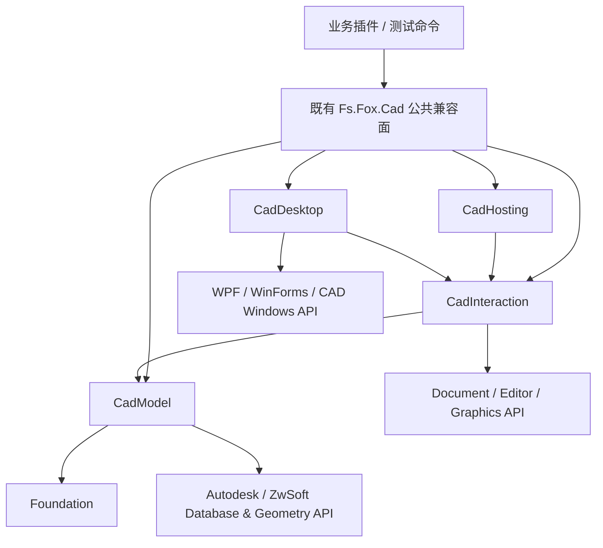

# Fs.Fox.CAD 渐进式模块化重构建议

> 状态：已取代（Superseded）<br>
> 基线：`main` @ `80f8da3`，2026-07-31<br>
> 历史跟踪：[Issue #25](https://github.com/FsDiG/Fs.Fox.CAD/issues/25)<br>
> 参考：[Issue #18](https://github.com/FsDiG/Fs.Fox.CAD/issues/18)<br>
> 历史实施：[单程序集逻辑模块化执行计划](logical-modularization-plan.md)<br>
> 现行入口：[架构说明](关于IFoxCAD的架构说明.md)、[`CADShared.projitems`](../src/CADShared/CADShared.projitems) 和 [`CADSharedModuleBaseline.json`](../Build/CADSharedModuleBaseline.json)

> 本文只保留前序调研和决策背景，不再作为实施规格。模块化计划和 Issue #25 只用于追溯；当前结构、维护规则和逐文件事实以上述现行入口及最新 `main` 为准，后续边界调整使用独立 Issue/PR 和短期分支。

## 1. 结论

建议采用“**先划清源码边界，再按收益决定是否拆程序集**”的渐进式路线，不直接执行 Issue #18 中一次拆分 5 个程序集、全量修改命名空间并同步翻转 `DBTrans` 默认行为的方案。

本轮重构的推荐完成状态是：

1. 保留现有 NuGet 包 ID、输出程序集名、`Fs.Fox.Cad` 公共命名空间和运行时行为。
2. 将共享源码划分为 `Foundation`、`CadModel`、`CadInteraction`、`CadDesktop`、`CadHosting` 五个**逻辑模块**，仍由现有宿主项目编译到同一程序集。
3. 使数据库/模型代码不再直接依赖 WPF、WinForms、消息框或窗口状态，并用自动检查固定依赖方向。
4. 将 `DBTrans` 安全性作为独立工作流处理：先显式化调用意图并补足宿主测试，不在结构迁移中改变默认提交语义。
5. 只有出现真实的无界面使用场景，且通过 API、包布局、旧二进制和 CAD 宿主验证后，才试点物理拆分程序集。

这条路线允许团队在第 2 阶段结束后停下。即使最终不拆 DLL，也已经获得更清晰的职责边界和更低的修改风险。

## 2. 当前事实

### 2.1 构建与发布模型

当前不是一个可脱离宿主的统一运行时，而是同一份 `CADShared` 源码分别绑定厂商 SDK 后编译：

| 正式发布目标 | 目标框架 | 输出程序集 |
| --- | --- | --- |
| `IFox.CAD.ACAD2019` | `net48` | `Fs.Fox.AutoCad.dll` |
| `IFox.CAD.ACAD2025` | `net8.0-windows7.0` | `Fs.Fox.AutoCad.dll` |
| `IFox.CAD.ZCAD2022` | `net48` | `Fs.Fox.ZwCad.dll` |
| `IFox.CAD.ZCAD2025` | `net48` | `Fs.Fox.ZwCad.dll` |

`src/CADShared/CADShared.projitems` 当前显式包含 94 个编译单元。平台项目通过不同的 `GlobalUsings.cs`，把共享源码中的 CAD 类型绑定到 Autodesk 或 ZwSoft 的真实类型。共享源码中有较多平台/版本条件编译，因此厂商类型身份和 SDK 代际仍是实际边界。

由此产生两个约束：

- 只要公共签名仍暴露 `Database`、`Transaction`、`ObjectId`、`Editor` 等厂商类型，就不能把主体简单改为一个与宿主无关的 `netstandard2.0` Core。
- 物理拆包会按厂商和 API 代际扩展构建、打包、部署和宿主验证矩阵，而不是只增加 5 个通用 DLL。

### 2.2 公共兼容面

现有使用方依赖的不只是 NuGet 包名，还包括：

- `Fs.Fox.AutoCad.dll` / `Fs.Fox.ZwCad.dll` 程序集身份；
- `Fs.Fox.Cad` 和 `Fs.Fox.Basal` 命名空间；
- 公共类型的 Assembly Qualified Name、反射发现和特性扫描；
- `DBTrans`、初始化顺序、消息提示等行为语义；
- 包内的 props、脚本、XML 文档和测试程序集布局。

因此，“移动文件”“修改命名空间”“移动类型到另一个程序集”“改变默认参数”是四种不同的兼容性变化，不能放在同一个机械迁移中处理。

### 2.3 UI 依赖并未形成独立边界

`src/Directory.Build.props` 对全部平台项目启用了 WPF 和 WinForms。实际桌面依赖散落在 `WindowEx`、`EditorEx`、`DatabaseEx`、`CheckFactory`、Idle/光标处理、重绘和键盘钩子等代码中，而不只存在于一个 UI 目录。

同时，CAD `Editor`、Prompt、Selection、Jig 和 Transient Graphics 属于宿主交互 API，但不等同于 WPF/WinForms。把它们全部归入桌面 UI 会混淆“依赖 CAD 交互宿主”和“依赖 Windows 窗口框架”这两个不同边界。

### 2.4 当前测试边界

`TestShared` 主要提供跨宿主编译覆盖及 `NETLOAD` 后执行的测试命令，不是脱离 CAD 进程的常规单元测试套件。构建成功只能证明编译期兼容，不能证明：

- CAD 加载和程序集解析成功；
- 命令、初始化和卸载顺序正确；
- 事务、文档锁、多文档及后台数据库行为正确；
- WPF/WinForms、Jig、Selection 等交互行为正确。

重构验收必须明确区分构建证据与 CAD 宿主证据。

## 3. 对 Issue #18 的取舍

### 3.1 保留的方向

- 建立可检查的单向依赖关系；
- 把 WPF/WinForms 从数据库和模型逻辑中隔离；
- 提升事务失败路径的安全性；
- 改善大型公共 API 的导航、维护和回归保护；
- 为后续无界面运行、诊断能力和可选组件保留演进空间。

### 3.2 需要修正的前提

1. **程序集数量不是架构目标。** 模块只有在需要独立引用、部署、版本或安全边界时才值得成为 DLL。
2. **`Core = netstandard2.0` 不符合当前公共 API。** 大量核心能力直接暴露厂商 CAD 类型；真正可跨宿主的部分必须先以依赖审计证明。
3. **Editor/Jig 不等于桌面 UI。** 它们应进入 `CadInteraction`，WPF、WinForms、Palette 和系统对话框才进入 `CadDesktop`。
4. **Toolkit 和 Diagnostics 是新增产品能力。** `BlockView`、Snooper、控件库、日志 Sink 等不应成为完成结构重构的前置条件；相关工作应继续由独立 Issue 跟踪。
5. **库不应拥有业务插件的组合根。** 许可证检查、业务 DI 容器和应用启动策略属于消费方插件；本库只提供宿主生命周期辅助。
6. **“目录即命名空间”不应追溯应用于全部既有 API。** 目录可以反映模块，旧公共类型继续保留原命名空间；新 API 再按需要使用子命名空间。
7. **`DBTrans` 不是只改一个默认值。** 当前 `Commit()` / `Abort()` 会立即释放事务，默认提交已被示例和下游代码依赖；其迁移必须与目录/程序集调整解耦。

## 4. 推荐的逻辑架构

以下边界先应用于源码和依赖规则，不代表立即生成 5 个程序集：



| 逻辑模块 | 主要职责 | 可以依赖 | 禁止依赖 |
| --- | --- | --- | --- |
| `Foundation` | 纯 BCL 数据结构、Guard、通用算法 | BCL | CAD SDK、WPF、WinForms、CAD 进程状态 |
| `CadModel` | 事务、数据库、符号表、实体/几何、ResultData、过滤表达式 | `Foundation`、厂商 Database/Geometry API | WPF、WinForms、Palette、消息框、全局窗口状态 |
| `CadInteraction` | Document、Editor、Prompt、Selection、Jig、Transient Graphics | `CadModel`、宿主交互 API | WPF 控件、WinForms 窗体、具体业务 UI |
| `CadDesktop` | WPF/WinForms、Palette、窗口句柄、系统对话框、桌面通知 | `CadInteraction`、Windows/CAD UI API | 被 `CadModel` 反向引用 |
| `CadHosting` | 自动注册、初始化、宿主事件和生命周期辅助 | `CadModel`、`CadInteraction`，必要时引用 `CadDesktop` | 业务许可证、业务 DI 组合根、具体插件启动策略 |

`PE`、`Assoc`、Win32 Hook 等低层能力应在依赖清单完成后逐项归类，不为了满足目录整齐而强行塞入 `Foundation`。无法立即归类的代码可以暂留 `Advanced` 区域，并记录依赖和宿主风险。

## 5. 实施路线

### Phase 0：建立不可回退的基线

目标：先知道哪些变化属于破坏，再开始移动源码。

- 记录四个正式发布目标的项目、TFM、SDK、程序集名、NuGet ID 和包内文件。
- 为四个正式发布产物建立公共 API 基线，并在 CI 中比较类型、成员和程序集身份变化。
- 清点 `CADShared` 文件到目标逻辑模块的映射，以及平台条件编译和 WPF/WinForms/CAD Windows 引用。
- 建立至少一个“旧版本编译、只替换新 DLL、不重新编译”的二进制兼容样例。
- 固定宿主验收清单：加载、命令注册、成功/异常事务、嵌套事务、多文档、后台数据库、Editor/Jig 和桌面 UI。

退出条件：任何 PR 都能明确回答它是否改变源码兼容、二进制兼容、行为兼容、包布局或宿主行为。

### Phase 1：只做逻辑模块化

目标：改善结构，但不改变消费者观察到的结果。

- 按逻辑模块移动源码，并把 `CADShared.projitems` 拆成若干模块化 MSBuild item 文件，再由现有平台项目聚合到同一程序集。
- 保留所有旧公共命名空间、类型名、签名、程序集名、包 ID 和默认行为。
- 一个 PR 只迁移一个内聚区域；机械移动不夹带 API 重命名、事务语义修改或新功能。
- 对目录导航补充索引文档，避免用全量命名空间迁移解决“类难找”的问题。
- 每个批次至少构建四个正式项目及对应测试项目，并比较公共 API 和包布局基线。

退出条件：源码已经按模块可导航，公共 API/包比较无意外差异，四个正式目标构建通过。

### Phase 2：清理真实依赖

目标：让依赖方向成为可编译、可检查的约束。

- 将 `CadModel` 中的 MessageBox、Cursor、DoEvents、窗口句柄和 Palette 访问移到 `CadDesktop` 或调用方。
- 将 `EditorEx` 中纯 Editor 能力与桌面消息框能力分开，但保持旧公共入口兼容；涉及用户可见行为的改动单独评审。
- 使用小而具体的内部端口隔离确有需要的宿主行为，不引入覆盖所有 CAD 能力的 `ICadPlatform` 上帝接口。
- 建立不启用 WPF/WinForms 的临时验证项目或等价的架构检查，确保 `Foundation` / `CadModel` 不再引用桌面 API。
- 将平台差异集中到窄适配点；不为了消除 `#if` 而伪造 Autodesk 与 ZwSoft 类型兼容。
- 保持现有单程序集发布，先验证边界稳定性和实际收益。

退出条件：低层模块的桌面依赖检查可在 CI 自动失败，正式构建矩阵通过，相关 CAD 宿主场景完成验证。

### Phase 3：按收益决定是否物理拆包

只有同时满足以下条件才进入本阶段：

- 已存在明确消费者需要无 WPF/WinForms、AcCoreConsole 或更小部署面；
- Phase 2 的依赖约束已稳定至少一个发布周期；
- 已设计旧包、旧程序集和旧类型身份的兼容方案；
- 能对预编译旧消费者执行二进制加载验证；
- 团队接受每个正式宿主/API 代际增加的构建、打包和验收成本。

建议先对 AutoCAD 2025 (`net8`) 与 ZWCAD 2025 (`net48`) 做不发布的双平台原型，验证：

- 项目引用和 NuGet 依赖图；
- `TypeForwardedTo` 或兼容 Facade 是否能支持旧二进制；
- 反射、特性扫描、XAML 类型解析和插件加载；
- 包内 props/脚本、复制行为和宿主程序集解析；
- 无界面入口确实不加载桌面程序集。

原型失败或收益不足时，维持单程序集模块化结构就是合法终点。不要为了兑现“五个 DLL”的形式继续扩大复杂度。

## 6. `DBTrans` 独立迁移建议

### 6.1 当前真实语义

当前构造函数默认 `commit: true`，`Dispose()` 时提交；传入 `commit: false` 时，异常离开 `using` 会执行 Abort。`Commit()` 和 `Abort()` 都会立即调用 `Dispose()`，不是只设置一个“完成”标记。

现有 API 已经可以表达显式成功后提交：

```csharp
using DBTrans tr = new(commit: false);

// 所有可能失败的修改
tr.CurrentSpace.AddEntity(entity);

// 必须位于成功路径末尾；调用后不能继续使用 tr
tr.Commit();
```

因此，安全性的第一步不是翻转默认值，而是让调用方明确选择语义。

### 6.2 推荐顺序

1. 增加 CAD 宿主测试命令，覆盖成功提交、异常回滚、显式 Abort、嵌套事务、文档锁、后台文件、视图恢复和事务栈清理。
2. 审计仓库自有调用点，对每个写事务显式传入 `commit: true` 或 `commit: false`；只读事务也要根据当前 Abort/View 行为验证后选择，不能机械替换。
3. 增加 Roslyn 检查或等价回归守卫，禁止仓库新代码省略 `commit` 意图。
4. 更新示例，优先展示 `commit: false` + 成功路径末尾 `Commit()`，同时明确 `Commit()` 会立即释放。
5. 如仍需要更直观的模型，新增并行的显式完成型 API（例如新的 Scope/Factory），先迁移自有调用方；不要直接改变旧 `DBTrans`。
6. 只有在单独的破坏性版本决策、迁移文档和宿主验证完成后，才考虑废弃旧的隐式默认行为。

直接把可选参数默认值从 `true` 改为 `false` 还会造成新旧二进制行为分裂：旧调用方在编译时已经把 `true` 写入调用点，重新编译后的同一源码才会传入新默认值。这种静默差异不应混入目录或程序集重构。

## 7. 明确不在本轮处理

- 不统一 AutoCAD 与 ZWCAD 为同一个运行时二进制。
- 不同时处理程序集重命名；相关讨论继续由 [Issue #15](https://github.com/FsDiG/Fs.Fox.CAD/issues/15) 跟踪。
- 不把 `MgdDbg`、BlockView、PropertyGrid、Toast 或完整日志系统作为重构验收项；相关产品能力继续由 [Issue #13](https://github.com/FsDiG/Fs.Fox.CAD/issues/13)、[Issue #14](https://github.com/FsDiG/Fs.Fox.CAD/issues/14) 或新 Issue 跟踪。
- 不引入完整 DI 框架、Repository 模式、`IClock` 等与已确认痛点无关的抽象。
- 不在结构迁移 PR 中新增业务功能、全量格式化或批量重命名公共 API。

## 8. 验收标准

### 每个阶段都必须满足

- `git diff` 能区分机械移动、依赖清理和行为变化。
- 四个正式类库项目及对应测试项目构建通过，且构建脚本正确传播失败退出码。
- 公共 API、程序集身份和 NuGet 包布局差异经过自动比较；预期差异有迁移说明。
- 未把 AutoCAD 的成功结论直接外推到 ZWCAD，反之亦然。
- 涉及宿主生命周期、事务、Editor/Jig 或桌面 UI 时，有对应 CAD 宿主验收记录。

### 物理拆包额外要求

- 预编译旧消费者在不重新编译的情况下可以加载并执行代表性路径，或明确按破坏性版本发布。
- 证明无界面消费者不需要解析桌面程序集，而不是只把文件移动到另一个 DLL。
- 四个正式 NuGet 包的依赖、安装、复制和卸载行为可预测，没有重复类型或程序集绑定冲突。
- 文档明确说明消费者应选择的包、宿主/API 代际和运行时限制。

## 9. 建议的后续 Issue 拆分

本提案通过后，再创建以下可独立验收的执行 Issue：

1. 建立公共 API、包布局和旧二进制兼容基线。
2. 输出 `CADShared` 文件到逻辑模块的依赖清单。
3. 按模块拆分 MSBuild item 文件，保持单程序集和零行为变化。
4. 隔离 `CadModel` 中的 WPF/WinForms/CAD Windows 依赖。
5. 显式化仓库内 `DBTrans` 提交意图并增加回归守卫。
6. 评估是否存在足以支持物理拆包的真实消费者和收益。

每个执行 Issue 都应给出涉及的正式构建目标、宿主验收范围和明确的“不处理”列表，避免重新演变为一次性全库改造。
