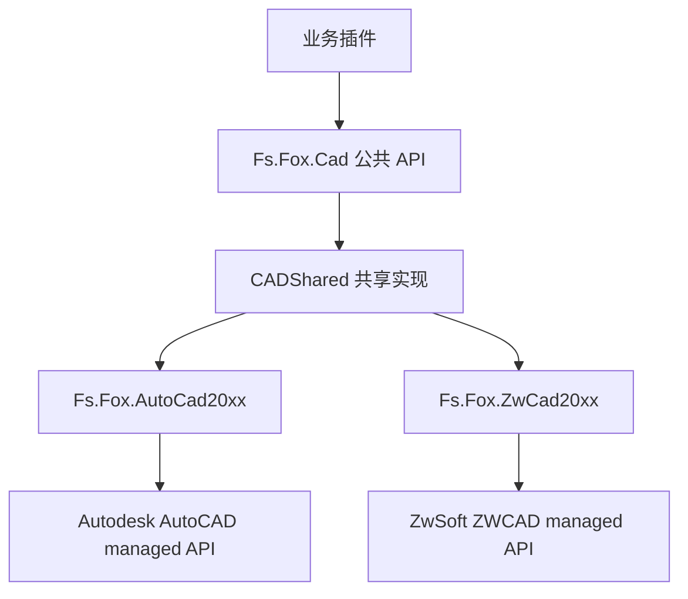
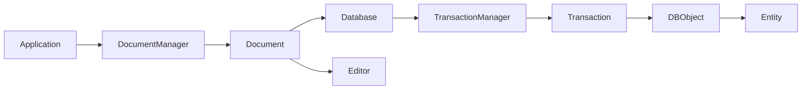

# Fs.Fox.CAD 架构说明

## 1. 目标与边界

Fs.Fox.CAD 在 AutoCAD/ZWCAD 托管 API 之上提供一个尽量小的核心和一组扩展方法。它主要解决事务样板代码、符号表访问、实体操作、结果数据和选择过滤等高频问题，同时保留 CAD 厂商原生对象模型。

设计上的两个边界是：

1. 不用自定义对象体系替代 `Database`、`Transaction`、`DBObject`、`Entity` 等厂商类型。
2. 不把 AutoCAD 与 ZWCAD 伪装成同一个运行时二进制；两类宿主共享源码，但分别编译和发布。

因此，Fs.Fox.CAD 更接近“托管 CAD API 的基础工具层”，而不是跨厂商 CAD 适配器或完整业务框架。

## 2. 分层关系


```mermaid
flowchart TB
    Plugin[业务插件] --> Fox[Fs.Fox.Cad 公共 API]
    Fox --> Core[CADShared 共享实现]
    Core --> AutoProject[Fs.Fox.AutoCad20xx]
    Core --> ZwProject[Fs.Fox.ZwCad20xx]
    AutoProject --> AutoSdk[Autodesk AutoCAD managed API]
    ZwProject --> ZwSdk[ZwSoft ZWCAD managed API]
```

`CADShared` 是源码共享项目，不会单独生成一个与宿主无关的运行时程序集。AutoCAD 与 ZWCAD 项目分别引入平台 `GlobalUsings.cs`，将共享源码中的 CAD 类型解析到对应厂商命名空间，然后生成：

- AutoCAD：`Fs.Fox.AutoCad.dll`
- ZWCAD：`Fs.Fox.ZwCad.dll`

两类程序集都公开 `Fs.Fox.Cad` 和 `Fs.Fox.Basal` 命名空间，但其中 CAD 对象的真实类型分别来自 Autodesk 和 ZwSoft 程序集，不能跨宿主交换。

## 3. CAD 对象模型

Fs.Fox.CAD 沿用厂商托管 API 的基本关系：应用程序管理文档，文档持有数据库和编辑器，数据库对象通过事务读取或修改。


```mermaid
flowchart LR
    Application --> DocumentManager
    DocumentManager --> Document
    Document --> Database
    Document --> Editor
    Database --> TransactionManager
    TransactionManager --> Transaction
    Transaction --> DBObject
    DBObject --> Entity
```

数据库中的符号表、命名字典和实体都遵循这一事务模型。Fs.Fox.CAD 的封装重点是减少重复的打开、升级写模式、登记新对象和提交代码，而不是绕过事务规则。

## 4. 核心抽象

### 4.1 DBTrans

`DBTrans` 是类库的主要事务入口，内部持有厂商 `Transaction`，并根据使用场景关联：

- `Document`、`Database` 和 `Editor`
- 当前空间、模型空间和常用符号表
- 命名对象字典及常见子字典
- 当前线程/调用链中的 `DBTrans` 栈

它支持三类入口：

```csharp
new DBTrans(Document? doc = null, bool commit = true, bool docLock = false)
new DBTrans(Database database, bool commit = true)
new DBTrans(string fileName, bool commit = true, ...)
```

典型实体写入代码如下：

```csharp
using DBTrans tr = new();
var line = new Line(
    new Point3d(0, 0, 0),
    new Point3d(100, 0, 0));

ObjectId lineId = tr.CurrentSpace.AddEntity(line);
```

默认 `commit: true`，释放 `DBTrans` 时提交事务。需要显式成功后再提交的流程可使用 `commit: false`，完成全部操作后调用 `Commit()`；需要放弃时调用 `Abort()`。`Commit()` 和 `Abort()` 都会释放当前事务，不应在调用后继续使用该 `DBTrans` 实例。

`DBTrans.Top` 用于获取当前栈顶事务，使扩展方法能够复用已有事务。调用方仍应清晰控制最外层事务的生命周期，避免把隐式栈状态扩散到无关流程。

### 4.2 SymbolTable

厂商 API 中的图层表、块表、文字样式表等都继承自符号表体系，但具体记录类型不同。Fs.Fox.CAD 的泛型 `SymbolTable<TTable, TRecord>` 统一以下常见动作：

- 按名称或 `ObjectId` 查找记录
- 获取可读/可写记录
- 添加、修改和复制记录
- 判断记录是否存在

`DBTrans` 暴露常用符号表属性，调用方无需反复从 `Database` 获取表 ID 并手动打开。块表的记录同时是实体容器，因此添加图元通常通过 `CurrentSpace`、`ModelSpace` 或指定 `BlockTableRecord` 完成。

### 4.3 扩展方法

扩展方法不再集中在一个 `ExtensionMethod` 根目录，而是与其主要扩展目标或所拥有的资源放在同一逻辑模块：

- `Cad/Database`：`Database`、`Transaction`、`DBObject`、`ObjectId`、实体、符号表、字典和外部参照。
- `Cad/Geometry`：点、曲线、坐标运算和空间索引。
- `Cad/Editor`：`Editor`、提示选项、选择集、Jig、命令派发和显示刷新。
- `Cad/Application`、`Cad/UI` 与 `Cad/Interop`：分别承载运行中会话、桌面界面和受限的宿主互操作能力。

这种调整只改变源码所有权和可发现性，不改变 `Fs.Fox.Cad`、`Fs.Fox.Basal` 等公共命名空间。扩展方法仍直接作用于厂商类型，便于与原生 API 混合使用。平台存在真实差异时，应使用平台/版本条件编译或独立实现，不应为了表面一致隐藏不兼容行为。

`ExtensionMethod/Geometry/ToDo` 下的 21 个文件仍是未编译的待整理源码，不属于当前公共实现。

### 4.4 ResultData、Lisp 与选择过滤

`Cad/Database/ResultData` 提供 `TypedValueList`、`XDataList` 和 `XRecordDataList`，用于构造和解析数据库相关的类型值序列。`LispList` 保留既有继承关系，但按运行时所有权放在 `Cad/Runtime/Lisp`。

`Cad/Editor/Selection/Filters` 提供比较和逻辑操作对象，用更结构化的方式组合 DXF 选择条件，最终仍交由宿主 `Editor`/选择 API 执行。

### 4.5 应用、运行时与互操作辅助

相关能力按生命周期和边界拆分：

- `Cad/Application`：当前会话、文档锁、系统变量和 Idle 调度。
- `Cad/Runtime`：程序集初始化发现、注册、加载/终止入口和 Lisp 运行时数据。
- `Cad/Interop`：CAD native ABI、宿主导出解析适配和第三方 ARX 接口。
- `Platform/Windows`：不依赖 CAD SDK 的 Win32 声明和 PE 文件解析。

这些目录表达主要所有权，并不宣称现有跨模块依赖已经清理完成。涉及宿主生命周期、native 调用或界面的行为修改，除编译检查外还应执行对应 CAD 版本的加载、卸载、多文档或交互场景验证。

## 5. 源码组织

```text
src/
  CADShared/
    Foundation/              不感知 CAD/Windows 的通用能力
      Compatibility/
    Platform/
      Windows/               Win32 与 PE 文件能力
        Interop/
        PortableExecutable/
    Cad/
      Interop/               CAD native 与第三方 ARX 边界
        Native/
        ThirdParty/
          Tianzheng/
      Geometry/              数学几何与空间索引
        SpatialIndex/
          QuadTree/
      Database/              DWG 对象与数据库生命周期
        Associativity/
        Collections/
        Dictionaries/
        Entities/
          Blocks/
          Bounds/
          Curves/
            Polylines/
          Hatch/
          Text/
        Files/
        Objects/
        ResultData/
        SymbolTables/
        Transactions/
        Xrefs/
      Editor/                输入、选择、Jig 与编辑器显示
        Commands/
        Display/
        Input/
        Jig/
        Selection/
          Filters/
      Application/           运行中的应用与文档会话
        Context/
        Documents/
        Scheduling/
        SystemVariables/
      Runtime/               程序集初始化、注册与 Lisp
        Initialization/
        Lisp/
        Registration/
      UI/                    对话框、窗口、状态栏与首选项
        Dialogs/
        Preferences/
        StatusBar/
        Windows/
    ExtensionMethod/
      Geometry/
        ToDo/                21 个未编译待整理文件
    CADShared.projitems       唯一共享编译入口
    CADShared.shproj
  IFoxCAD.AutoCad/           AutoCAD 平台 using、别名及构建文件
  IFoxCAD.ZwCad/             ZWCAD 平台 using 和别名
  Fs.Fox.AutoCad20xx/        AutoCAD 版本项目
  Fs.Fox.ZwCad20xx/          ZWCAD 版本项目
tests/
  TestShared/                共享 CAD 测试命令
  TestAcad20xx/              AutoCAD 宿主测试入口
  TestZcad20xx/              ZWCAD 宿主测试入口
```

`CADShared.projitems` 当前显式列出 112 个共享编译项，并通过 `FsFoxModule` 和 `FsFoxOrder` 记录九个逻辑模块及稳定编译顺序。目录只表达源码所有权，不改变公共命名空间，也不意味着九个独立 DLL；完整映射和已知边界债务见[单程序集逻辑模块化执行计划](logical-modularization-plan.md)。

版本项目是 SDK/API 代际边界，不要求每个产品年度都有一个项目。只有厂商 API、目标框架或二进制兼容性发生变化时才应新增项目；可兼容年度优先复用已有产物，并用兼容性文档记录依据和宿主验收状态。

## 6. 测试边界

`TestShared` 同样以共享源码方式导入各宿主测试项目。这能验证同一功能是否可在不同平台编译，并提供 `NETLOAD` 后可执行的测试命令，但它不是脱离 CAD 进程运行的常规单元测试套件。

验证应分为两层：

1. 构建层：恢复依赖，编译类库与对应测试程序集。
2. 宿主层：在目标 CAD 中验证加载、命令注册、事务/数据库操作、界面入口及部署机制。

具体构建入口见根目录 [构建说明](../编译说明.md)，版本兼容结论应查阅对应平台文档。
